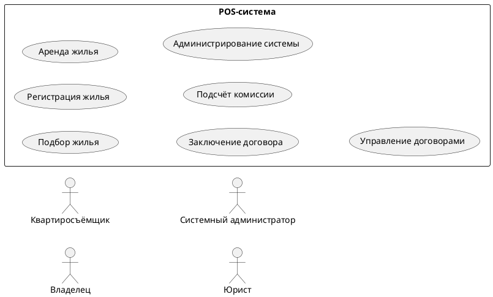

```plantuml
@startuml
skinparam packageStyle rect
left to right direction
:Квартиросъёмщик:
:Владелец:
:Системный администратор:
:Юрист:

package POS-система {
(Подбор жилья)
(Регистрация жилья)
(Аренда жилья)
(Заключение договора)
(Подсчёт комиссии)
(Администрирование системы)
(Управление договорами)
}

@enduml
```

