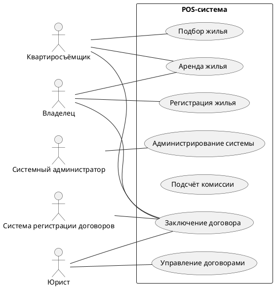

```plantuml
@startuml
skinparam packageStyle rect
left to right direction
:Квартиросъёмщик:
:Владелец:
:Системный администратор:
:Юрист:

package POS-система {
(Подбор жилья)
(Регистрация жилья)
(Аренда жилья)
(Заключение договора)
(Подсчёт комиссии)
(Администрирование системы)
(Управление договорами)
}

:Квартиросъёмщик: -- (Подбор жилья)
:Квартиросъёмщик: -- (Аренда жилья)
:Квартиросъёмщик: -- (Заключение договора)

:Владелец: -- (Регистрация жилья)
:Владелец: -- (Аренда жилья)
:Владелец: -- (Заключение договора)

:Системный администратор: -- (Администрирование системы)

:Юрист: -- (Управление договорами)
:Юрист: -- (Заключение договора)

:Система регистрации договоров: -- (Заключение договора)
@enduml
```

