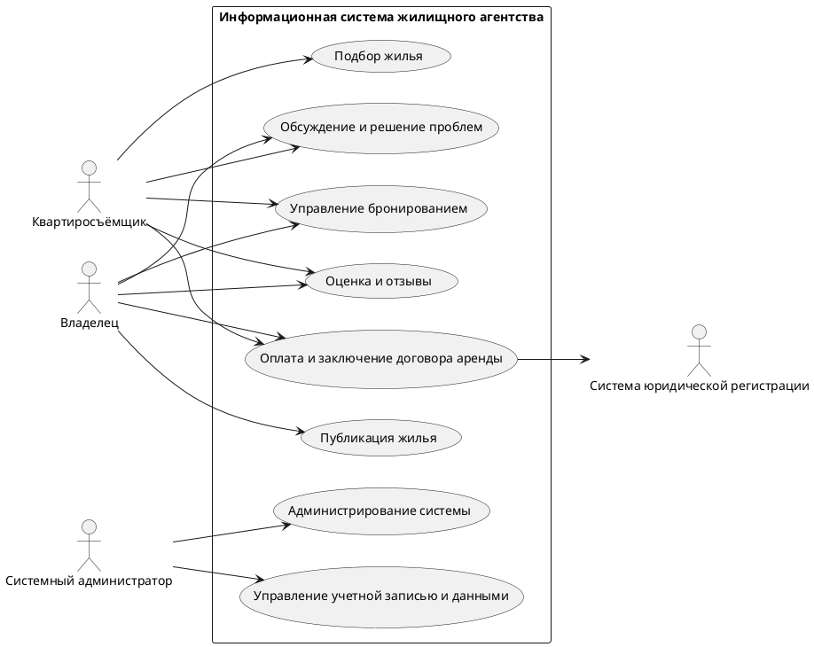

```plantuml
@startuml
skinparam packageStyle rect
left to right direction

:Квартиросъёмщик:
:Владелец:
:Системный администратор:

package "Информационная система жилищного агентства" {
  (Оплата и заключение договора аренды)
  (Подбор жилья)
  (Публикация жилья)
  (Управление бронированием)
  (Оценка и отзывы)
  (Обсуждение и решение проблем)
  (Администрирование системы)
  (Управление учетной записью и данными)
}

:Квартиросъёмщик: --> (Подбор жилья)
:Квартиросъёмщик: --> (Управление бронированием)
:Квартиросъёмщик: --> (Оплата и заключение договора аренды)
:Квартиросъёмщик: --> (Оценка и отзывы)
:Квартиросъёмщик: --> (Обсуждение и решение проблем)

:Владелец: --> (Публикация жилья)
:Владелец: --> (Управление бронированием)
:Владелец: --> (Оплата и заключение договора аренды)
:Владелец: --> (Оценка и отзывы)
:Владелец: --> (Обсуждение и решение проблем)

:Системный администратор: --> (Администрирование системы)
:Системный администратор: --> (Управление учетной записью и данными)

(Оплата и заключение договора аренды) --> :Система юридической регистрации:
@enduml
```
