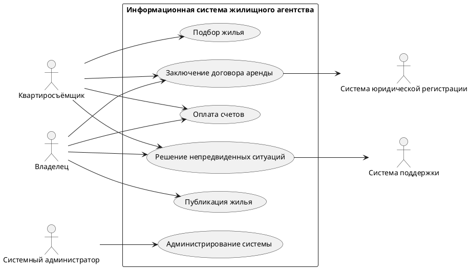

```plantuml
@startuml
skinparam packageStyle rect
left to right direction

:Квартиросъёмщик:
:Владелец:
:Системный администратор:

package "Информационная система жилищного агентства" {
(Оплата счетов)
(Подбор жилья)
(Публикация жилья)
(Заключение договора аренды)
(Администрирование системы)
(Решение непредвиденных ситуаций)
}

:Квартиросъёмщик: --> (Подбор жилья)
:Квартиросъёмщик: --> (Заключение договора аренды)
:Квартиросъёмщик: --> (Оплата счетов)

:Владелец: --> (Публикация жилья)
:Владелец: --> (Заключение договора аренды)
:Владелец: --> (Оплата счетов)

:Системный администратор: --> (Администрирование системы)

:Владелец: --> (Решение непредвиденных ситуаций)
:Квартиросъёмщик: --> (Решение непредвиденных ситуаций)

:Система юридической регистрации:
:Система поддержки:

(Решение непредвиденных ситуаций) --> :Система поддержки:
(Заключение договора аренды) --> :Система юридической регистрации:

@enduml
```
