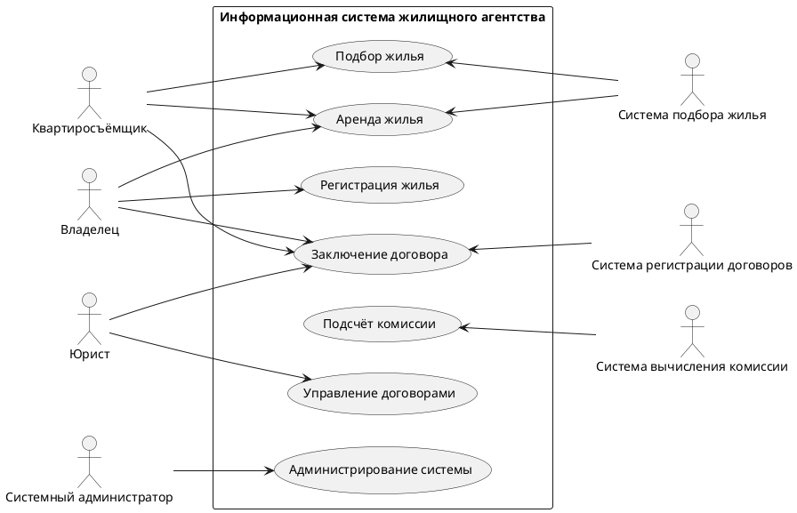

```plantuml
@startuml
skinparam packageStyle rect
left to right direction

:Квартиросъёмщик:
:Владелец:
:Системный администратор:
:Юрист:

package "Информационная система жилищного агентства" {

(Подбор жилья)
(Регистрация жилья)
(Аренда жилья)
(Заключение договора)
(Подсчёт комиссии)
(Администрирование системы)
(Управление договорами)

}

:Квартиросъёмщик: --> (Подбор жилья)
:Квартиросъёмщик: --> (Аренда жилья)
:Квартиросъёмщик: --> (Заключение договора)

:Владелец: --> (Регистрация жилья)
:Владелец: --> (Аренда жилья)
:Владелец: --> (Заключение договора)

:Системный администратор: --> (Администрирование системы)

:Юрист: --> (Управление договорами)
:Юрист: --> (Заключение договора)

:Система регистрации договоров:
:Система вычисления комиссии:
:Система подбора жилья:

(Заключение договора) <-- :Система регистрации договоров:
(Подбор жилья) <-- :Система подбора жилья:
(Подсчёт комиссии) <-- :Система вычисления комиссии:

(Аренда жилья) <-- :Система подбора жилья:

@enduml
```