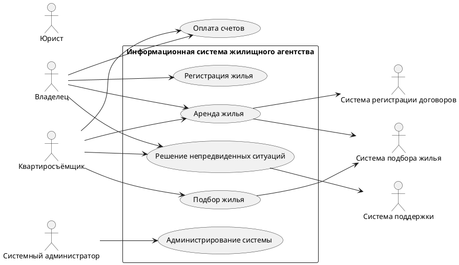

```plantuml
@startuml
skinparam packageStyle rect
left to right direction

:Квартиросъёмщик:
:Владелец:
:Системный администратор:
:Юрист:

package "Информационная система жилищного агентства" {

(Подбор жилья)
(Регистрация жилья)
(Аренда жилья)
(Администрирование системы)
(Решение непредвиденных ситуаций)
}

:Квартиросъёмщик: --> (Подбор жилья)
:Квартиросъёмщик: --> (Аренда жилья)
:Квартиросъёмщик: --> (Оплата счетов)

:Владелец: --> (Регистрация жилья)
:Владелец: --> (Аренда жилья)
:Владелец: --> (Оплата счетов)

:Системный администратор: --> (Администрирование системы)

:Владелец: --> (Решение непредвиденных ситуаций)
:Квартиросъёмщик: --> (Решение непредвиденных ситуаций)

:Система регистрации договоров:
:Система подбора жилья:
:Система поддержки:

(Подбор жилья) --> :Система подбора жилья:
(Решение непредвиденных ситуаций) --> :Система поддержки:
(Аренда жилья) --> :Система подбора жилья:
(Аренда жилья) --> :Система регистрации договоров:

@enduml
```
