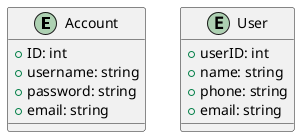

```plantuml
@startuml
entity Account {
    +ID: int
    +username: string
    +password: string
    +email: string
}

entity User {
    +userID: int
    +name: string
    +phone: string
    +email: string
}


@enduml
```