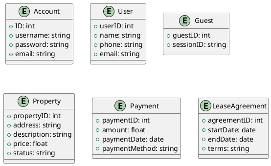

```plantuml
@startuml
entity Account {
    +ID: int
    +username: string
    +password: string
    +email: string
}

entity User {
    +userID: int
    +name: string
    +phone: string
    +email: string
}

entity Guest {
    +guestID: int
    +sessionID: string
}

entity Property {
    +propertyID: int
    +address: string
    +description: string
    +price: float
    +status: string
}

entity Payment {
    +paymentID: int
    +amount: float
    +paymentDate: date
    +paymentMethod: string
}

entity LeaseAgreement {
    +agreementID: int
    +startDate: date
    +endDate: date
    +terms: string
}

@enduml
```