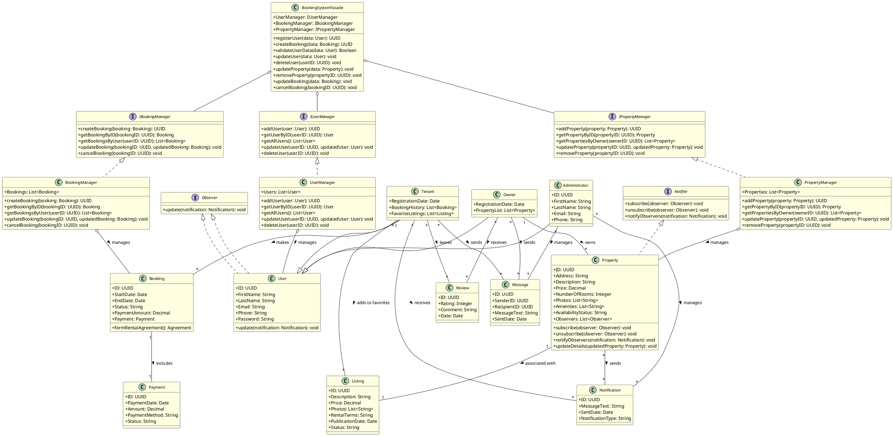

```plantuml
@startuml
skinparam classAttributeIconSize 0
skinparam classFontSize 12
skinparam classFontName Arial
skinparam classBackgroundColor LightYellow
skinparam classBorderColor Black
skinparam packageBackgroundColor LightBlue
skinparam packageBorderColor Black

' --- Интерфейсы ---
interface Observer {
  +update(notification: Notification): void
}

interface Notifier {
  +subscribe(observer: Observer): void
  +unsubscribe(observer: Observer): void
  +notifyObservers(notification: Notification): void
}

interface IUserManager {
  +addUser(user: User): UUID
  +getUserByID(userID: UUID): User
  +getAllUsers(): List<User>
  +updateUser(userID: UUID, updatedUser: User): void
  +deleteUser(userID: UUID): void
}

interface IBookingManager {
  +createBooking(booking: Booking): UUID
  +getBookingByID(bookingID: UUID): Booking
  +getBookingsByUser(userID: UUID): List<Booking>
  +updateBooking(bookingID: UUID, updatedBooking: Booking): void
  +cancelBooking(bookingID: UUID): void
}

interface IPropertyManager {
  +addProperty(property: Property): UUID
  +getPropertyByID(propertyID: UUID): Property
  +getPropertiesByOwner(ownerID: UUID): List<Property>
  +updateProperty(propertyID: UUID, updatedProperty: Property): void
  +removeProperty(propertyID: UUID): void
}

' --- Фасад ---
class BookingSystemFacade {
  +UserManager: IUserManager
  +BookingManager: IBookingManager
  +PropertyManager: IPropertyManager
  +registerUser(data: User): UUID
  +createBooking(data: Booking): UUID
  +validateUserData(data: User): Boolean
  +updateUser(data: User): void
  +deleteUser(userID: UUID): void
  +updateProperty(data: Property): void
  +removeProperty(propertyID: UUID): void
  +updateBooking(data: Booking): void
  +cancelBooking(bookingID: UUID): void
}

' --- Модули системы ---
class UserManager implements IUserManager {
  +Users: List<User>
  +addUser(user: User): UUID
  +getUserByID(userID: UUID): User
  +getAllUsers(): List<User>
  +updateUser(userID: UUID, updatedUser: User): void
  +deleteUser(userID: UUID): void
}

class BookingManager implements IBookingManager {
  +Bookings: List<Booking>
  +createBooking(booking: Booking): UUID
  +getBookingByID(bookingID: UUID): Booking
  +getBookingsByUser(userID: UUID): List<Booking>
  +updateBooking(bookingID: UUID, updatedBooking: Booking): void
  +cancelBooking(bookingID: UUID): void
}

class PropertyManager implements IPropertyManager {
  +Properties: List<Property>
  +addProperty(property: Property): UUID
  +getPropertyByID(propertyID: UUID): Property
  +getPropertiesByOwner(ownerID: UUID): List<Property>
  +updateProperty(propertyID: UUID, updatedProperty: Property): void
  +removeProperty(propertyID: UUID): void
}

' --- Пользователи ---
class User implements Observer {
  +ID: UUID
  +FirstName: String
  +LastName: String
  +Email: String
  +Phone: String
  +Password: String
  +update(notification: Notification): void
}

class Tenant {
  +RegistrationDate: Date
  +BookingHistory: List<Booking>
  +FavoriteListings: List<Listing>
}

class Owner {
  +RegistrationDate: Date
  +PropertyList: List<Property>
}

class Administrator {
  +ID: UUID
  +FirstName: String
  +LastName: String
  +Email: String
  +Phone: String
}

' --- Связанные классы ---
class Property implements Notifier {
  +ID: UUID
  +Address: String
  +Description: String
  +Price: Decimal
  +NumberOfRooms: Integer
  +Photos: List<String>
  +Amenities: List<String>
  +AvailabilityStatus: String
  +Observers: List<Observer>
  +subscribe(observer: Observer): void
  +unsubscribe(observer: Observer): void
  +notifyObservers(notification: Notification): void
  +updateDetails(updatedProperty: Property): void
}

class Listing {
  +ID: UUID
  +Description: String
  +Price: Decimal
  +Photos: List<String>
  +RentalTerms: String
  +PublicationDate: Date
  +Status: String
}

class Booking {
  +ID: UUID
  +StartDate: Date
  +EndDate: Date
  +Status: String
  +PaymentAmount: Decimal
  +Payment: Payment
  +formRentalAgreement(): Agreement
}

class Payment {
  +ID: UUID
  +PaymentDate: Date
  +Amount: Decimal
  +PaymentMethod: String
  +Status: String
}

class Notification {
  +ID: UUID
  +MessageText: String
  +SentDate: Date
  +NotificationType: String
}

class Review {
  +ID: UUID
  +Rating: Integer
  +Comment: String
  +Date: Date
}

class Message {
  +ID: UUID
  +SenderID: UUID
  +RecipientID: UUID
  +MessageText: String
  +SentDate: Date
}

' --- Связи ---
BookingSystemFacade o-- IUserManager
BookingSystemFacade o-- IBookingManager
BookingSystemFacade o-- IPropertyManager

UserManager o-- User : manages >
BookingManager o-- Booking : manages >
PropertyManager o-- Property : manages >

User ..|> Observer
Tenant --|> User
Owner --|> User
Administrator --|> User

Owner "1" -- "*" Property : owns >
Property "1" -- "1" Listing : associated with >
Tenant "1" -- "*" Booking : makes >
Booking "1" -- "1" Payment : includes >
Tenant "*" -- "*" Listing : adds to favorites >
Property "*" -- "*" Notification : sends >
Tenant "*" -- "*" Notification : receives >
Tenant "*" -- "*" Review : leaves >
Owner "*" -- "*" Review : receives >
Tenant "*" -- "*" Message : sends >
Owner "*" -- "*" Message : sends >
Administrator "*" -- "*" Notification : manages >
Administrator "*" -- "*" Message : manages >
@enduml
```
