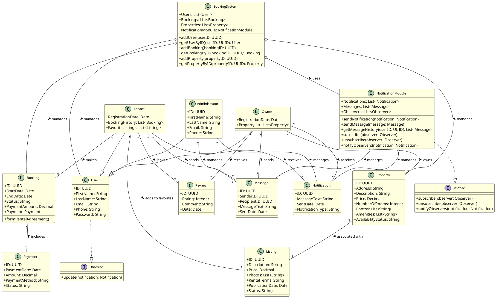

```plantuml
@startuml
skinparam classAttributeIconSize 0
skinparam classFontSize 12
skinparam classFontName Arial
skinparam classBackgroundColor LightYellow
skinparam classBorderColor Black
skinparam packageBackgroundColor LightBlue
skinparam packageBorderColor Black

interface Observer {
  +update(notification: Notification)
}

interface Notifier {
  +subscribe(observer: Observer)
  +unsubscribe(observer: Observer)
  +notifyObservers(notification: Notification)
}

class "BookingSystem" {
  +Users: List<User>
  +Bookings: List<Booking>
  +Properties: List<Property>
  +NotificationModule: NotificationModule
  +addUser(userID: UUID)
  +getUserByID(userID: UUID): User
  +addBooking(bookingID: UUID)
  +getBookingByID(bookingID: UUID): Booking
  +addProperty(propertyID: UUID)
  +getPropertyByID(propertyID: UUID): Property
}

class "NotificationModule" {
  +Notifications: List<Notification>
  +Messages: List<Message>
  +Observers: List<Observer>
  +sendNotification(notification: Notification)
  +sendMessage(message: Message)
  +getMessageHistory(userID: UUID): List<Message>
  +subscribe(observer: Observer)
  +unsubscribe(observer: Observer)
  +notifyObservers(notification: Notification)
}

class "User" {
  +ID: UUID
  +FirstName: String
  +LastName: String
  +Email: String
  +Phone: String
  +Password: String
}

class "Tenant" {
  +RegistrationDate: Date
  +BookingHistory: List<Booking>
  +FavoriteListings: List<Listing>
}

class "Owner" {
  +RegistrationDate: Date
  +PropertyList: List<Property>
}

class "Administrator" {
  +ID: UUID
  +FirstName: String
  +LastName: String
  +Email: String
  +Phone: String
}

class "Property" {
  +ID: UUID
  +Address: String
  +Description: String
  +Price: Decimal
  +NumberOfRooms: Integer
  +Photos: List<String>
  +Amenities: List<String>
  +AvailabilityStatus: String
}

class "Listing" {
  +ID: UUID
  +Description: String
  +Price: Decimal
  +Photos: List<String>
  +RentalTerms: String
  +PublicationDate: Date
  +Status: String
}

class "Booking" {
  +ID: UUID
  +StartDate: Date
  +EndDate: Date
  +Status: String
  +PaymentAmount: Decimal
  +Payment: Payment
  +formRentalAgreement()
}

class "Payment" {
  +ID: UUID
  +PaymentDate: Date
  +Amount: Decimal
  +PaymentMethod: String
  +Status: String
}

class "Notification" {
  +ID: UUID
  +MessageText: String
  +SentDate: Date
  +NotificationType: String
}

class "Review" {
  +ID: UUID
  +Rating: Integer
  +Comment: String
  +Date: Date
}

class "Message" {
  +ID: UUID
  +SenderID: UUID
  +RecipientID: UUID
  +MessageText: String
  +SentDate: Date
}

"BookingSystem" o-- "User" : manages >
"BookingSystem" o-- "Booking" : manages >
"BookingSystem" o-- "Property" : manages >
"BookingSystem" o-- "NotificationModule" : uses >

"NotificationModule" o-- "Notification" : manages >
"NotificationModule" o-- "Message" : manages >
"NotificationModule" ..|> "Notifier"

"User" ..|> "Observer"
"Tenant" --|> "User"
"Owner" --|> "User"
"Administrator" --|> "User"

"Owner" "1" -- "*" "Property" : owns >
"Property" "1" -- "1" "Listing" : associated with >
"Tenant" "1" -- "*" "Booking" : makes >
"Booking" "1" -- "1" "Payment" : includes >
"Tenant" "*" -- "*" "Listing" : adds to favorites >
"Owner" "*" -- "*" "Notification" : receives >
"Tenant" "*" -- "*" "Notification" : receives >
"Tenant" "*" -- "*" "Review" : leaves >
"Owner" "*" -- "*" "Review" : receives >
"Tenant" "*" -- "*" "Message" : sends >
"Owner" "*" -- "*" "Message" : sends >
"Administrator" "*" -- "*" "Notification" : manages >
"Administrator" "*" -- "*" "Message" : manages >
@enduml
```
