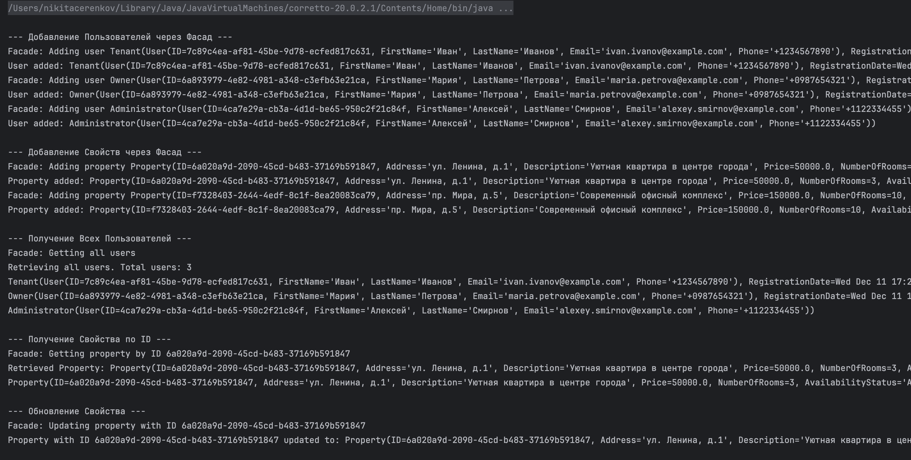
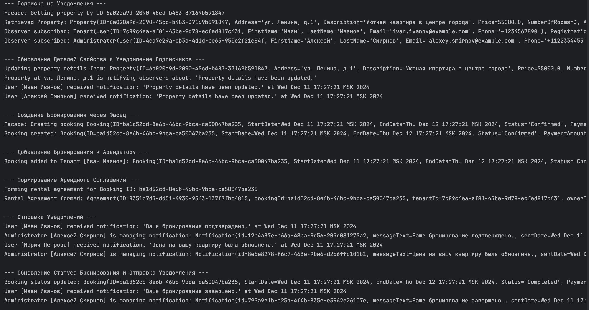

# Практическая работа №1
## Модельно-ориентированный подход к проектированию

## Порядок выполнения практической работы
 
1.	При помощи программы StarUML либо любого редактора построить UML-диаграмму вариантов использования, диаграмму классов проектируемой информационной системы в соответствии с вариантом задания, а также диаграмму последовательности для наиболее часто используемых прецедентов . При построении диаграммы классов нужно добиться достаточной детализации информационной системы. Убедитесь в том, что использовали отношения dependency, aggregation/composition, generalization, описали размещение классов по пакетам проекта.

2.	Подготовить отчет с включением диаграмм.
Рекомендации по разработке диаграмм вариантов использования
-	Диаграмма вариантов использования может служить основой для согласования с заказчиком функциональных требований к системе на ранней стадии проектирования.
-	Рекомендуемая последовательность действий

    -	Определить главных или первичных и второстепенных актеров 
    -	Определить цели главных актеров по отношению к системе 
    -	Сформулировать основные варианты использования, которые специфицируют функциональные требования к системе 
    -	Упорядочить варианты использования по степени убывания риска их реализации 
    -	Рассмотреть все базовые варианты использования в порядке убывания их степени риска 
    -	Выделить участников, интересы, предусловия и постусловия выполнения выбранного варианта использования 
    -	Написать успешный сценарий реализации выбранного варианта использования 
    -	Определить исключения или неуспех в выполнении сценария варианта использования 
    -	Написать сценарии для всех исключений 
    -	Выделить общие варианты использования и изобразить их взаимосвязи с базовыми со стереотипом <<include>> 
    -	Выделить варианты использования для исключений и изобразить их взаимосвязи с базовыми со стереотипом <<extend>> 
    -	Проверить диаграмму на отсутствие дублирования вариантов использования и актеров 

## Контрольные вопросы

1.	Что такое UML? Какие вы знаете основные диаграммы UML?
2.	Какие элементы входят в состав диаграммы классов? 

## Полезные ссылки

1.	http://www.omg.org/mda/
2.	OMG UML Specification http://www.omg.org/spec/UML/ 
3.	OMG XMI Specification http://www.omg.org/spec/XMI/ 
4.	Статья об MDA - https://www.osp.ru/os/2003/09/183391/ 
5.	Статьи о UML Refactoring https://www.researchgate.net/publication/311856689_Model_and_Criteria_for_the_Automated_Refactoring_of_the_UML_Class_Diagrams 

## Вариант

8.Информационная система жилищного агентства
Обзор: информационная система жилищного агентства позволяет квартиросъемщикам подобрать и снять жилье, а владельцам жилья - предложить и сдать жилье.

Пример: https://gitlab.com/penamarth/pos.git

# 🏠 Жилищная арендная система

Данный проект представляет собой симуляцию системы аренды недвижимости. Программа поддерживает функционал регистрации пользователей, публикации объявлений, бронирования жилья и отправки уведомлений о действиях.

---

## 📋 Основные функции
- **Регистрация пользователей**: Владельцы и арендаторы могут зарегистрироваться и подписаться на уведомления.
- **Публикация объявлений**: Владельцы недвижимости могут добавлять свои объекты.
- **Бронирование недвижимости**: Арендаторы могут бронировать доступные объекты.
- **Отправка уведомлений**: Пользователи получают уведомления о публикации объявлений, бронированиях, оплате и оставленных отзывах.

---

## 💻 Пример работы

Программа демонстрирует следующий процесс:

1. **Регистрация пользователей**:
    - Владельцы и арендаторы регистрируются и подписываются на типы уведомлений (например, уведомления о бронировании, оплате или отзывах).

2. **Добавление объявления**:
    - Владельцы публикуют информацию о недвижимости (например, "Квартира с видом на парк").

3. **Создание бронирования и договора аренды**:
    - Формируется соглашение аренды с указанием цены, адреса и идентификатора договора.

4. **Уведомления**:
    - Владельцы получают уведомления о новых бронированиях.
    - Арендаторы получают уведомления о подтверждении оплаты.
    - Оставляются отзывы, которые отображаются в системе.

### Скриншот симуляции

---

## 🚀 Запуск проекта

### 1. Установка
Для запуска убедитесь, что на вашем компьютере установлен Java (версия 20+). Далее:
1. Скомпилируйте код в вашей IDE (например, IntelliJ IDEA) или используйте команду `gradlew` в терминале.
2. Запустите проект.

### 2. Результаты работы
При успешном запуске вы увидите симуляцию взаимодействия между владельцами и арендаторами, включая отправку уведомлений. 

---

## 🔔 Пример уведомлений

Пример выводимых уведомлений:
- **Регистрация пользователя**:  
  `Владелец Иван Иванов зарегистрирован и подписан на уведомления.`
  
- **Бронирование**:  
  `Иван Иванов получил уведомление: Новое бронирование для вашей недвижимости: Улица Ленина, 10.`

- **Оплата**:  
  `Анна Петрова получила уведомление: Платеж в размере 150.0 выполнен.`

- **Отзыв**:  
  `Иван Иванов получил уведомление: Новый отзыв на вашу недвижимость: Отличная квартира! Очень понравилось!`

---

## 🛠 Используемые технологии
- **Язык программирования**: Java (Corretto 20)/Kotlin.
- **Среда разработки**: IntelliJ IDEA.