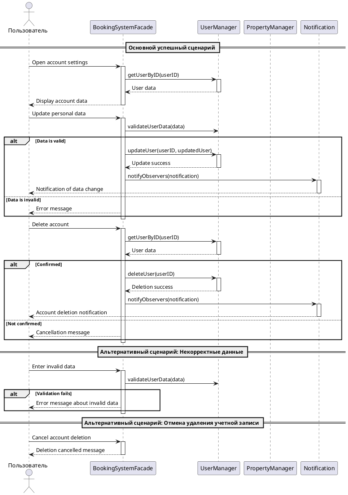

```plantuml
@startuml

actor "Пользователь" as User
participant "BookingSystemFacade" as Facade
participant "UserManager" as UserManager
participant "PropertyManager" as PropertyManager
participant "Notification" as Notifier

== Основной успешный сценарий ==

User -> Facade : Open account settings
activate Facade

Facade -> UserManager : getUserByID(userID)
activate UserManager
UserManager --> Facade : User data

deactivate UserManager
Facade --> User : Display account data

deactivate Facade

User -> Facade : Update personal data
activate Facade

Facade -> UserManager : validateUserData(data)
alt Data is valid
    Facade -> UserManager : updateUser(userID, updatedUser)
    activate UserManager
    UserManager --> Facade : Update success
    deactivate UserManager

    Facade -> Notifier : notifyObservers(notification)
    activate Notifier
    Notifier --> User : Notification of data change
    deactivate Notifier
else Data is invalid
    Facade --> User : Error message
end

deactivate Facade

User -> Facade : Delete account
activate Facade

Facade -> UserManager : getUserByID(userID)
activate UserManager
UserManager --> Facade : User data

deactivate UserManager
alt Confirmed
    Facade -> UserManager : deleteUser(userID)
    activate UserManager
    UserManager --> Facade : Deletion success
    deactivate UserManager

    Facade -> Notifier : notifyObservers(notification)
    activate Notifier
    Notifier --> User : Account deletion notification
    deactivate Notifier
else Not confirmed
    Facade --> User : Cancellation message
end

deactivate Facade

== Альтернативный сценарий: Некорректные данные ==

User -> Facade : Enter invalid data
activate Facade
Facade -> UserManager : validateUserData(data)
alt Validation fails
    Facade --> User : Error message about invalid data
end

deactivate Facade

== Альтернативный сценарий: Отмена удаления учетной записи ==

User -> Facade : Cancel account deletion
activate Facade
Facade --> User : Deletion cancelled message

deactivate Facade

@enduml
```