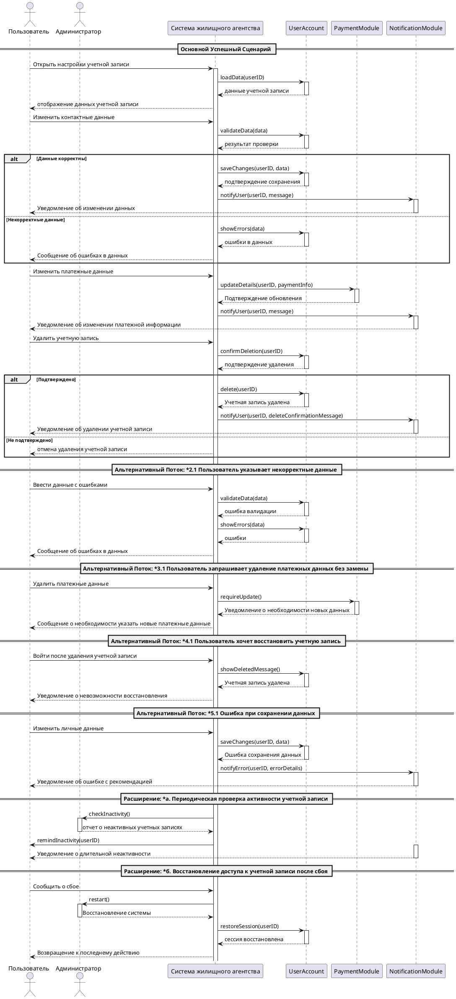

```plantuml
@startuml

actor "Пользователь" as User
actor "Администратор" as Admin

participant "Система жилищного агентства" as System
participant "UserAccount" as Account
participant "PaymentModule" as Payment
participant "NotificationModule" as Notifier

== Основной Успешный Сценарий ==

User -> System : Открыть настройки учетной записи
activate System

System -> Account : loadData(userID)
activate Account
Account --> System : данные учетной записи
deactivate Account

System --> User : отображение данных учетной записи

User -> System : Изменить контактные данные
System -> Account : validateData(data)
activate Account
Account --> System : результат проверки
deactivate Account

alt Данные корректны
    System -> Account : saveChanges(userID, data)
    activate Account
    Account --> System : подтверждение сохранения
    deactivate Account

    System -> Notifier : notifyUser(userID, message)
    activate Notifier
    Notifier --> User : Уведомление об изменении данных
    deactivate Notifier
else Некорректные данные
    System -> Account : showErrors(data)
    activate Account
    Account --> System : ошибки в данных
    deactivate Account

    System --> User : Сообщение об ошибках в данных
end

User -> System : Изменить платежные данные
System -> Payment : updateDetails(userID, paymentInfo)
activate Payment
Payment --> System : Подтверждение обновления
deactivate Payment

System -> Notifier : notifyUser(userID, message)
activate Notifier
Notifier --> User : Уведомление об изменении платежной информации
deactivate Notifier

User -> System : Удалить учетную запись
System -> Account : confirmDeletion(userID)
activate Account
Account --> System : подтверждение удаления
deactivate Account

alt Подтверждено
    System -> Account : delete(userID)
    activate Account
    Account --> System : Учетная запись удалена
    deactivate Account

    System -> Notifier : notifyUser(userID, deleteConfirmationMessage)
    activate Notifier
    Notifier --> User : Уведомление об удалении учетной записи
    deactivate Notifier
else Не подтверждено
    System --> User : отмена удаления учетной записи
end

== Альтернативный Поток: *2.1 Пользователь указывает некорректные данные ==

User -> System : Ввести данные с ошибками
System -> Account : validateData(data)
activate Account
Account --> System : ошибка валидации
deactivate Account

System -> Account : showErrors(data)
activate Account
Account --> System : ошибки
deactivate Account

System --> User : Сообщение об ошибках в данных

== Альтернативный Поток: *3.1 Пользователь запрашивает удаление платежных данных без замены ==

User -> System : Удалить платежные данные
System -> Payment : requireUpdate()
activate Payment
Payment --> System : Уведомление о необходимости новых данных
deactivate Payment

System --> User : Сообщение о необходимости указать новые платежные данные

== Альтернативный Поток: *4.1 Пользователь хочет восстановить учетную запись ==

User -> System : Войти после удаления учетной записи
System -> Account : showDeletedMessage()
activate Account
Account --> System : Учетная запись удалена
deactivate Account

System --> User : Уведомление о невозможности восстановления

== Альтернативный Поток: *5.1 Ошибка при сохранении данных ==

User -> System : Изменить личные данные
System -> Account : saveChanges(userID, data)
activate Account
Account --> System : Ошибка сохранения данных
deactivate Account

System -> Notifier : notifyError(userID, errorDetails)
activate Notifier
Notifier --> User : Уведомление об ошибке с рекомендацией
deactivate Notifier

== Расширение: *а. Периодическая проверка активности учетной записи ==

System -> Admin : checkInactivity()
activate Admin
Admin --> System : отчет о неактивных учетных записях
deactivate Admin

System -> User : remindInactivity(userID)
activate Notifier
Notifier --> User : Уведомление о длительной неактивности
deactivate Notifier

== Расширение: *б. Восстановление доступа к учетной записи после сбоя ==

User -> System : Сообщить о сбое
System -> Admin : restart()
activate Admin
Admin --> System : Восстановление системы
deactivate Admin

System -> Account : restoreSession(userID)
activate Account
Account --> System : сессия восстановлена
deactivate Account

System --> User : Возвращение к последнему действию

@enduml
```