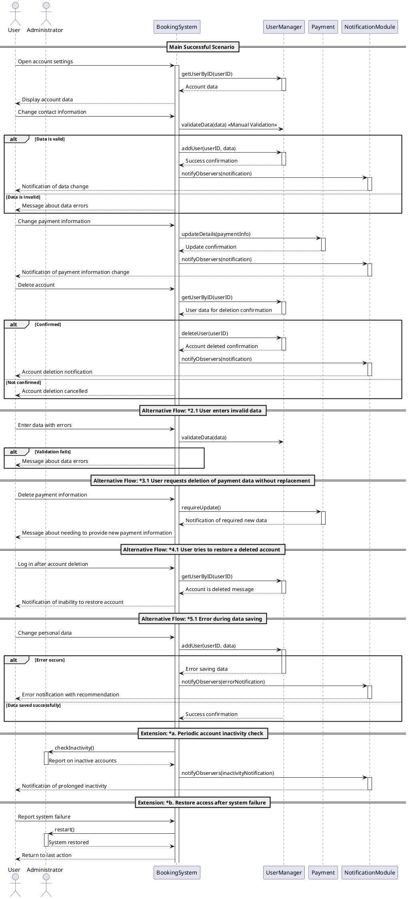

```plantuml
@startuml

actor "User" as User
actor "Administrator" as Admin

participant "BookingSystem" as System
participant "UserManager" as UserManager
participant "Payment" as Payment
participant "NotificationModule" as Notifier

== Main Successful Scenario ==

User -> System : Open account settings
activate System

System -> UserManager : getUserByID(userID)
activate UserManager
UserManager --> System : Account data
deactivate UserManager

System --> User : Display account data

User -> System : Change contact information
System -> UserManager : validateData(data) <<Manual Validation>> 
alt Data is valid
    System -> UserManager : addUser(userID, data)
    activate UserManager
    UserManager --> System : Success confirmation
    deactivate UserManager

    System -> Notifier : notifyObservers(notification)
    activate Notifier
    Notifier --> User : Notification of data change
    deactivate Notifier
else Data is invalid
    System --> User : Message about data errors
end

User -> System : Change payment information
System -> Payment : updateDetails(paymentInfo)
activate Payment
Payment --> System : Update confirmation
deactivate Payment

System -> Notifier : notifyObservers(notification)
activate Notifier
Notifier --> User : Notification of payment information change
deactivate Notifier

User -> System : Delete account
System -> UserManager : getUserByID(userID)
activate UserManager
UserManager --> System : User data for deletion confirmation
deactivate UserManager

alt Confirmed
    System -> UserManager : deleteUser(userID)
    activate UserManager
    UserManager --> System : Account deleted confirmation
    deactivate UserManager

    System -> Notifier : notifyObservers(notification)
    activate Notifier
    Notifier --> User : Account deletion notification
    deactivate Notifier
else Not confirmed
    System --> User : Account deletion cancelled
end

== Alternative Flow: *2.1 User enters invalid data ==

User -> System : Enter data with errors
System -> UserManager : validateData(data)
alt Validation fails
    System --> User : Message about data errors
end

== Alternative Flow: *3.1 User requests deletion of payment data without replacement ==

User -> System : Delete payment information
System -> Payment : requireUpdate()
activate Payment
Payment --> System : Notification of required new data
deactivate Payment

System --> User : Message about needing to provide new payment information

== Alternative Flow: *4.1 User tries to restore a deleted account ==

User -> System : Log in after account deletion
System -> UserManager : getUserByID(userID)
activate UserManager
UserManager --> System : Account is deleted message
deactivate UserManager

System --> User : Notification of inability to restore account

== Alternative Flow: *5.1 Error during data saving ==

User -> System : Change personal data
System -> UserManager : addUser(userID, data)
activate UserManager
alt Error occurs
    UserManager --> System : Error saving data
    deactivate UserManager

    System -> Notifier : notifyObservers(errorNotification)
    activate Notifier
    Notifier --> User : Error notification with recommendation
    deactivate Notifier
else Data saved successfully
    UserManager --> System : Success confirmation
    deactivate UserManager
end

== Extension: *a. Periodic account inactivity check ==

System -> Admin : checkInactivity()
activate Admin
Admin --> System : Report on inactive accounts
deactivate Admin

System -> Notifier : notifyObservers(inactivityNotification)
activate Notifier
Notifier --> User : Notification of prolonged inactivity
deactivate Notifier

== Extension: *b. Restore access after system failure ==

User -> System : Report system failure
System -> Admin : restart()
activate Admin
Admin --> System : System restored
deactivate Admin

System --> User : Return to last action

@enduml
```