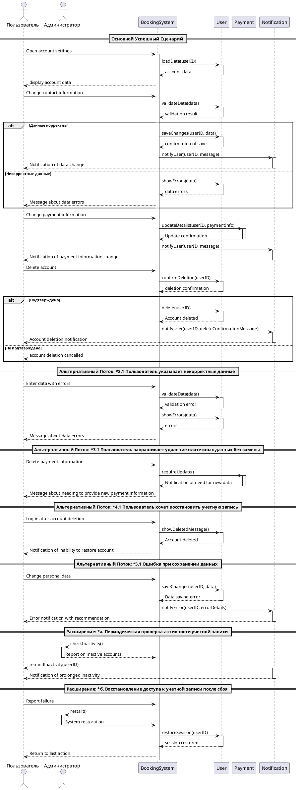

```plantuml
@startuml

actor "Пользователь" as User
actor "Администратор" as Admin

participant "BookingSystem" as System
participant "User" as Account
participant "Payment" as Payment
participant "Notification" as Notifier

== Основной Успешный Сценарий ==

User -> System : Open account settings
activate System

System -> Account : loadData(userID)
activate Account
Account --> System : account data
deactivate Account

System --> User : display account data

User -> System : Change contact information
System -> Account : validateData(data)
activate Account
Account --> System : validation result
deactivate Account

alt Данные корректны
    System -> Account : saveChanges(userID, data)
    activate Account
    Account --> System : confirmation of save
    deactivate Account

    System -> Notifier : notifyUser(userID, message)
    activate Notifier
    Notifier --> User : Notification of data change
    deactivate Notifier
else Некорректные данные
    System -> Account : showErrors(data)
    activate Account
    Account --> System : data errors
    deactivate Account

    System --> User : Message about data errors
end

User -> System : Change payment information
System -> Payment : updateDetails(userID, paymentInfo)
activate Payment
Payment --> System : Update confirmation
deactivate Payment

System -> Notifier : notifyUser(userID, message)
activate Notifier
Notifier --> User : Notification of payment information change
deactivate Notifier

User -> System : Delete account
System -> Account : confirmDeletion(userID)
activate Account
Account --> System : deletion confirmation
deactivate Account

alt Подтверждено
    System -> Account : delete(userID)
    activate Account
    Account --> System : Account deleted
    deactivate Account

    System -> Notifier : notifyUser(userID, deleteConfirmationMessage)
    activate Notifier
    Notifier --> User : Account deletion notification
    deactivate Notifier
else Не подтверждено
    System --> User : account deletion cancelled
end

== Альтернативный Поток: *2.1 Пользователь указывает некорректные данные ==

User -> System : Enter data with errors
System -> Account : validateData(data)
activate Account
Account --> System : validation error
deactivate Account

System -> Account : showErrors(data)
activate Account
Account --> System : errors
deactivate Account

System --> User : Message about data errors

== Альтернативный Поток: *3.1 Пользователь запрашивает удаление платежных данных без замены ==

User -> System : Delete payment information
System -> Payment : requireUpdate()
activate Payment
Payment --> System : Notification of need for new data
deactivate Payment

System --> User : Message about needing to provide new payment information

== Альтернативный Поток: *4.1 Пользователь хочет восстановить учетную запись ==

User -> System : Log in after account deletion
System -> Account : showDeletedMessage()
activate Account
Account --> System : Account deleted
deactivate Account

System --> User : Notification of inability to restore account

== Альтернативный Поток: *5.1 Ошибка при сохранении данных ==

User -> System : Change personal data
System -> Account : saveChanges(userID, data)
activate Account
Account --> System : Data saving error
deactivate Account

System -> Notifier : notifyError(userID, errorDetails)
activate Notifier
Notifier --> User : Error notification with recommendation
deactivate Notifier

== Расширение: *а. Периодическая проверка активности учетной записи ==

System -> Admin : checkInactivity()
activate Admin
Admin --> System : Report on inactive accounts
deactivate Admin

System -> User : remindInactivity(userID)
activate Notifier
Notifier --> User : Notification of prolonged inactivity
deactivate Notifier

== Расширение: *б. Восстановление доступа к учетной записи после сбоя ==

User -> System : Report failure
System -> Admin : restart()
activate Admin
Admin --> System : System restoration
deactivate Admin

System -> Account : restoreSession(userID)
activate Account
Account --> System : session restored
deactivate Account

System --> User : Return to last action

@enduml
```