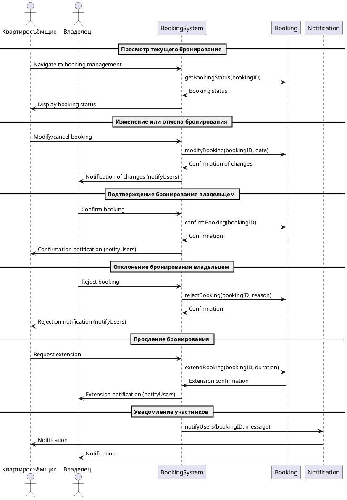

```plantuml

@startuml
actor Квартиросъёмщик
actor Владелец
participant "BookingSystem" as System
participant "Booking" as Booking
participant "Notification" as NotificationService

== Просмотр текущего бронирования ==
Квартиросъёмщик -> System: Navigate to booking management
System -> Booking: getBookingStatus(bookingID)
Booking -> System: Booking status
System -> Квартиросъёмщик: Display booking status

== Изменение или отмена бронирования ==
Квартиросъёмщик -> System: Modify/cancel booking
System -> Booking: modifyBooking(bookingID, data)
Booking -> System: Confirmation of changes
System -> Владелец: Notification of changes (notifyUsers)

== Подтверждение бронирования владельцем ==
Владелец -> System: Confirm booking
System -> Booking: confirmBooking(bookingID)
Booking -> System: Confirmation
System -> Квартиросъёмщик: Confirmation notification (notifyUsers)

== Отклонение бронирования владельцем ==
Владелец -> System: Reject booking
System -> Booking: rejectBooking(bookingID, reason)
Booking -> System: Confirmation
System -> Квартиросъёмщик: Rejection notification (notifyUsers)

== Продление бронирования ==
Квартиросъёмщик -> System: Request extension
System -> Booking: extendBooking(bookingID, duration)
Booking -> System: Extension confirmation
System -> Владелец: Extension notification (notifyUsers)

== Уведомление участников ==
System -> NotificationService: notifyUsers(bookingID, message)
NotificationService -> Квартиросъёмщик: Notification
NotificationService -> Владелец: Notification

@enduml

```