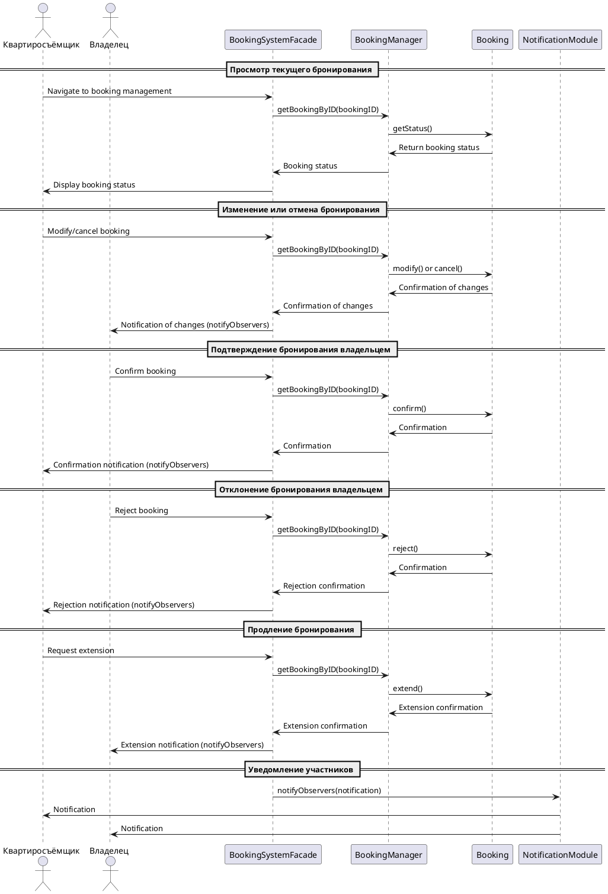

```plantuml

@startuml
actor Квартиросъёмщик
actor Владелец
participant "BookingSystemFacade" as System
participant "BookingManager" as BookingManager
participant "Booking" as Booking
participant "NotificationModule" as NotificationModule

== Просмотр текущего бронирования ==
Квартиросъёмщик -> System: Navigate to booking management
System -> BookingManager: getBookingByID(bookingID)
BookingManager -> Booking: getStatus()
Booking -> BookingManager: Return booking status
BookingManager -> System: Booking status
System -> Квартиросъёмщик: Display booking status

== Изменение или отмена бронирования ==
Квартиросъёмщик -> System: Modify/cancel booking
System -> BookingManager: getBookingByID(bookingID)
BookingManager -> Booking: modify() or cancel()
Booking -> BookingManager: Confirmation of changes
BookingManager -> System: Confirmation of changes
System -> Владелец: Notification of changes (notifyObservers)

== Подтверждение бронирования владельцем ==
Владелец -> System: Confirm booking
System -> BookingManager: getBookingByID(bookingID)
BookingManager -> Booking: confirm()
Booking -> BookingManager: Confirmation
BookingManager -> System: Confirmation
System -> Квартиросъёмщик: Confirmation notification (notifyObservers)

== Отклонение бронирования владельцем ==
Владелец -> System: Reject booking
System -> BookingManager: getBookingByID(bookingID)
BookingManager -> Booking: reject()
Booking -> BookingManager: Confirmation
BookingManager -> System: Rejection confirmation
System -> Квартиросъёмщик: Rejection notification (notifyObservers)

== Продление бронирования ==
Квартиросъёмщик -> System: Request extension
System -> BookingManager: getBookingByID(bookingID)
BookingManager -> Booking: extend()
Booking -> BookingManager: Extension confirmation
BookingManager -> System: Extension confirmation
System -> Владелец: Extension notification (notifyObservers)

== Уведомление участников ==
System -> NotificationModule: notifyObservers(notification)
NotificationModule -> Квартиросъёмщик: Notification
NotificationModule -> Владелец: Notification

@enduml


```