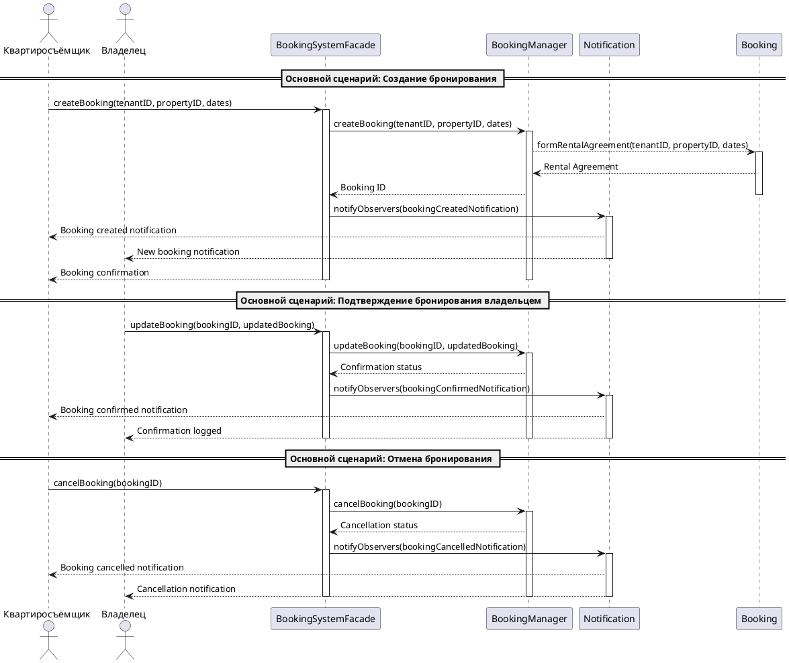

```plantuml
@startuml

actor "Квартиросъёмщик" as Tenant
actor "Владелец" as Owner
participant "BookingSystemFacade" as Facade
participant "BookingManager" as Manager
participant "Notification" as Notification
participant "Booking" as Booking

== Основной сценарий: Создание бронирования ==

Tenant -> Facade : createBooking(tenantID, propertyID, dates)
activate Facade
Facade -> Manager : createBooking(tenantID, propertyID, dates)
activate Manager
Manager --> Booking : formRentalAgreement(tenantID, propertyID, dates)
activate Booking
Booking --> Manager : Rental Agreement
Manager --> Facade : Booking ID
deactivate Booking
Facade -> Notification : notifyObservers(bookingCreatedNotification)
activate Notification
Notification --> Tenant : Booking created notification
Notification --> Owner : New booking notification
deactivate Notification
Facade --> Tenant : Booking confirmation

deactivate Manager
deactivate Facade

== Основной сценарий: Подтверждение бронирования владельцем ==

Owner -> Facade : updateBooking(bookingID, updatedBooking)
activate Facade
Facade -> Manager : updateBooking(bookingID, updatedBooking)
activate Manager
Manager --> Facade : Confirmation status
Facade -> Notification : notifyObservers(bookingConfirmedNotification)
activate Notification
Notification --> Tenant : Booking confirmed notification
Notification --> Owner : Confirmation logged

deactivate Notification
deactivate Manager
deactivate Facade

== Основной сценарий: Отмена бронирования ==

Tenant -> Facade : cancelBooking(bookingID)
activate Facade
Facade -> Manager : cancelBooking(bookingID)
activate Manager
Manager --> Facade : Cancellation status
Facade -> Notification : notifyObservers(bookingCancelledNotification)
activate Notification
Notification --> Tenant : Booking cancelled notification
Notification --> Owner : Cancellation notification
deactivate Notification
deactivate Manager
deactivate Facade

@enduml
```
