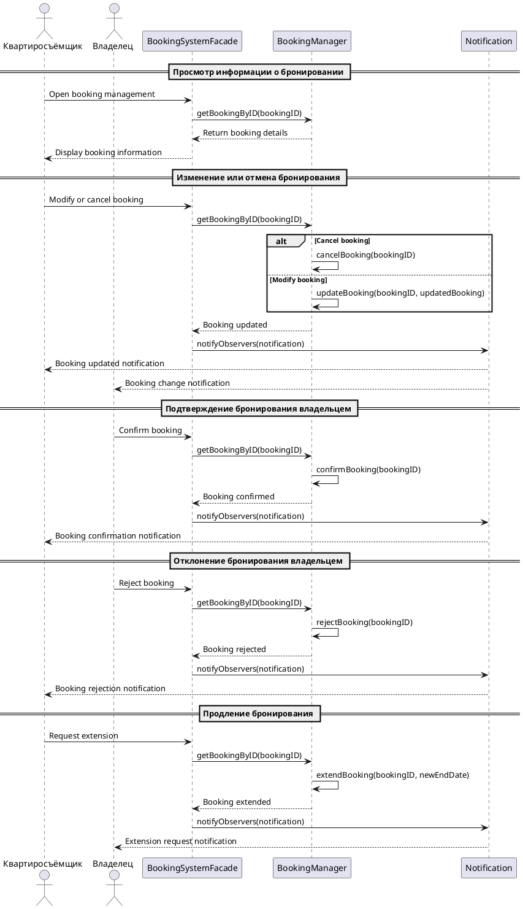

```plantuml
@startuml

actor "Квартиросъёмщик" as Tenant
actor "Владелец" as Owner
participant "BookingSystemFacade" as Facade
participant "BookingManager" as BookingManager
participant "Notification" as Notifier

== Просмотр информации о бронировании ==
Tenant -> Facade: Open booking management
Facade -> BookingManager: getBookingByID(bookingID)
BookingManager --> Facade: Return booking details
Facade --> Tenant: Display booking information

== Изменение или отмена бронирования ==
Tenant -> Facade: Modify or cancel booking
Facade -> BookingManager: getBookingByID(bookingID)
alt Cancel booking
    BookingManager -> BookingManager: cancelBooking(bookingID)
else Modify booking
    BookingManager -> BookingManager: updateBooking(bookingID, updatedBooking)
end
BookingManager --> Facade: Booking updated
Facade -> Notifier: notifyObservers(notification)
Notifier --> Tenant: Booking updated notification
Notifier --> Owner: Booking change notification

== Подтверждение бронирования владельцем ==
Owner -> Facade: Confirm booking
Facade -> BookingManager: getBookingByID(bookingID)
BookingManager -> BookingManager: confirmBooking(bookingID)
BookingManager --> Facade: Booking confirmed
Facade -> Notifier: notifyObservers(notification)
Notifier --> Tenant: Booking confirmation notification

== Отклонение бронирования владельцем ==
Owner -> Facade: Reject booking
Facade -> BookingManager: getBookingByID(bookingID)
BookingManager -> BookingManager: rejectBooking(bookingID)
BookingManager --> Facade: Booking rejected
Facade -> Notifier: notifyObservers(notification)
Notifier --> Tenant: Booking rejection notification

== Продление бронирования ==
Tenant -> Facade: Request extension
Facade -> BookingManager: getBookingByID(bookingID)
BookingManager -> BookingManager: extendBooking(bookingID, newEndDate)
BookingManager --> Facade: Booking extended
Facade -> Notifier: notifyObservers(notification)
Notifier --> Owner: Extension request notification

@enduml
```
