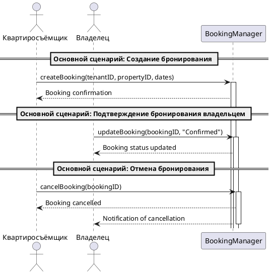

```plantuml
@startuml

actor "Квартиросъёмщик" as Tenant
actor "Владелец" as Owner
participant "BookingManager" as Manager

== Основной сценарий: Создание бронирования ==

Tenant -> Manager : createBooking(tenantID, propertyID, dates)
activate Manager
Manager --> Tenant : Booking confirmation

== Основной сценарий: Подтверждение бронирования владельцем ==

Owner -> Manager : updateBooking(bookingID, "Confirmed")
activate Manager
Manager --> Owner : Booking status updated

== Основной сценарий: Отмена бронирования ==

Tenant -> Manager : cancelBooking(bookingID)
activate Manager
Manager --> Tenant : Booking cancelled
Manager --> Owner : Notification of cancellation

deactivate Manager

@enduml
```
