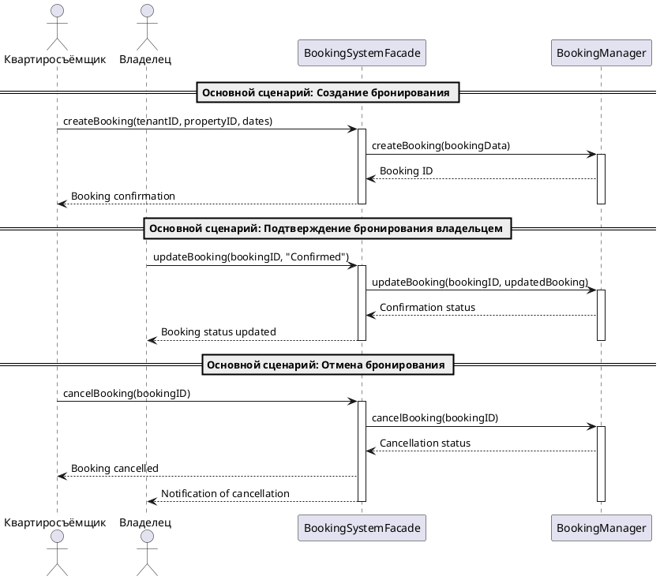

```plantuml
@startuml

actor "Квартиросъёмщик" as Tenant
actor "Владелец" as Owner
participant "BookingSystemFacade" as Facade
participant "BookingManager" as Manager

== Основной сценарий: Создание бронирования ==

Tenant -> Facade : createBooking(tenantID, propertyID, dates)
activate Facade
Facade -> Manager : createBooking(bookingData)
activate Manager
Manager --> Facade : Booking ID
Facade --> Tenant : Booking confirmation

deactivate Manager
deactivate Facade

== Основной сценарий: Подтверждение бронирования владельцем ==

Owner -> Facade : updateBooking(bookingID, "Confirmed")
activate Facade
Facade -> Manager : updateBooking(bookingID, updatedBooking)
activate Manager
Manager --> Facade : Confirmation status
Facade --> Owner : Booking status updated

deactivate Manager
deactivate Facade

== Основной сценарий: Отмена бронирования ==

Tenant -> Facade : cancelBooking(bookingID)
activate Facade
Facade -> Manager : cancelBooking(bookingID)
activate Manager
Manager --> Facade : Cancellation status
Facade --> Tenant : Booking cancelled
Facade --> Owner : Notification of cancellation

deactivate Manager
deactivate Facade

@enduml
```
