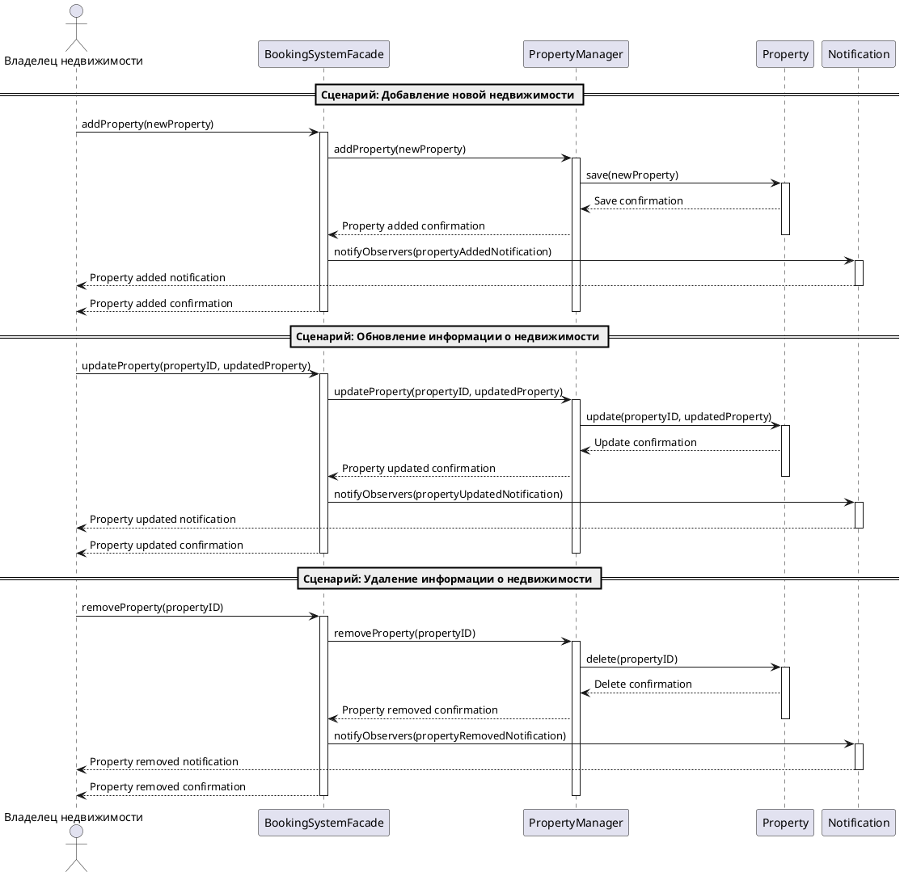

```plantuml
@startuml

actor "Владелец недвижимости" as Owner
participant "BookingSystemFacade" as Facade
participant "PropertyManager" as Manager
participant "Property" as Property
participant "Notification" as Notification

== Сценарий: Добавление новой недвижимости ==

Owner -> Facade : addProperty(newProperty)
activate Facade
Facade -> Manager : addProperty(newProperty)
activate Manager
Manager -> Property : save(newProperty)
activate Property
Property --> Manager : Save confirmation
Manager --> Facade : Property added confirmation
deactivate Property
Facade -> Notification : notifyObservers(propertyAddedNotification)
activate Notification
Notification --> Owner : Property added notification
deactivate Notification
Facade --> Owner : Property added confirmation

deactivate Manager
deactivate Facade

== Сценарий: Обновление информации о недвижимости ==

Owner -> Facade : updateProperty(propertyID, updatedProperty)
activate Facade
Facade -> Manager : updateProperty(propertyID, updatedProperty)
activate Manager
Manager -> Property : update(propertyID, updatedProperty)
activate Property
Property --> Manager : Update confirmation
Manager --> Facade : Property updated confirmation
deactivate Property
Facade -> Notification : notifyObservers(propertyUpdatedNotification)
activate Notification
Notification --> Owner : Property updated notification
deactivate Notification
Facade --> Owner : Property updated confirmation

deactivate Manager
deactivate Facade

== Сценарий: Удаление информации о недвижимости ==

Owner -> Facade : removeProperty(propertyID)
activate Facade
Facade -> Manager : removeProperty(propertyID)
activate Manager
Manager -> Property : delete(propertyID)
activate Property
Property --> Manager : Delete confirmation
Manager --> Facade : Property removed confirmation
deactivate Property
Facade -> Notification : notifyObservers(propertyRemovedNotification)
activate Notification
Notification --> Owner : Property removed notification
deactivate Notification
Facade --> Owner : Property removed confirmation

deactivate Manager
deactivate Facade

@enduml
```
