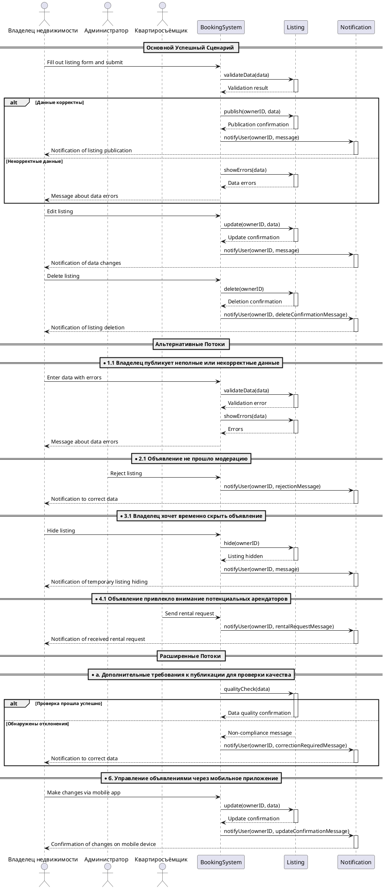

```plantuml
@startuml

actor "Владелец недвижимости" as Owner
actor "Администратор" as Admin
actor "Квартиросъёмщик" as Tenant

participant "BookingSystem" as System
participant "Listing" as Listing
participant "Notification" as Notifier

== Основной Успешный Сценарий ==

Owner -> System : Fill out listing form and submit
System -> Listing : validateData(data)
activate Listing
Listing --> System : Validation result
deactivate Listing

alt Данные корректны
    System -> Listing : publish(ownerID, data)
    activate Listing
    Listing --> System : Publication confirmation
    deactivate Listing

    System -> Notifier : notifyUser(ownerID, message)
    activate Notifier
    Notifier --> Owner : Notification of listing publication
    deactivate Notifier
else Некорректные данные
    System -> Listing : showErrors(data)
    activate Listing
    Listing --> System : Data errors
    deactivate Listing

    System --> Owner : Message about data errors
end

Owner -> System : Edit listing
System -> Listing : update(ownerID, data)
activate Listing
Listing --> System : Update confirmation
deactivate Listing

System -> Notifier : notifyUser(ownerID, message)
activate Notifier
Notifier --> Owner : Notification of data changes
deactivate Notifier

Owner -> System : Delete listing
System -> Listing : delete(ownerID)
activate Listing
Listing --> System : Deletion confirmation
deactivate Listing

System -> Notifier : notifyUser(ownerID, deleteConfirmationMessage)
activate Notifier
Notifier --> Owner : Notification of listing deletion
deactivate Notifier

== Альтернативные Потоки ==

== *1.1 Владелец публикует неполные или некорректные данные ==

Owner -> System : Enter data with errors
System -> Listing : validateData(data)
activate Listing
Listing --> System : Validation error
deactivate Listing

System -> Listing : showErrors(data)
activate Listing
Listing --> System : Errors
deactivate Listing

System --> Owner : Message about data errors

== *2.1 Объявление не прошло модерацию ==

Admin -> System : Reject listing
System -> Notifier : notifyUser(ownerID, rejectionMessage)
activate Notifier
Notifier --> Owner : Notification to correct data
deactivate Notifier

== *3.1 Владелец хочет временно скрыть объявление ==

Owner -> System : Hide listing
System -> Listing : hide(ownerID)
activate Listing
Listing --> System : Listing hidden
deactivate Listing

System -> Notifier : notifyUser(ownerID, message)
activate Notifier
Notifier --> Owner : Notification of temporary listing hiding
deactivate Notifier

== *4.1 Объявление привлекло внимание потенциальных арендаторов ==

Tenant -> System : Send rental request
System -> Notifier : notifyUser(ownerID, rentalRequestMessage)
activate Notifier
Notifier --> Owner : Notification of received rental request
deactivate Notifier

== Расширенные Потоки ==

== *а. Дополнительные требования к публикации для проверки качества ==

System -> Listing : qualityCheck(data)
activate Listing
alt Проверка прошла успешно
    Listing --> System : Data quality confirmation
deactivate Listing
else Обнаружены отклонения
    Listing --> System : Non-compliance message
    System -> Notifier : notifyUser(ownerID, correctionRequiredMessage)
    activate Notifier
    Notifier --> Owner : Notification to correct data
    deactivate Notifier
end

== *б. Управление объявлениями через мобильное приложение ==

Owner -> System : Make changes via mobile app
System -> Listing : update(ownerID, data)
activate Listing
Listing --> System : Update confirmation
deactivate Listing

System -> Notifier : notifyUser(ownerID, updateConfirmationMessage)
activate Notifier
Notifier --> Owner : Confirmation of changes on mobile device
deactivate Notifier

@enduml
```