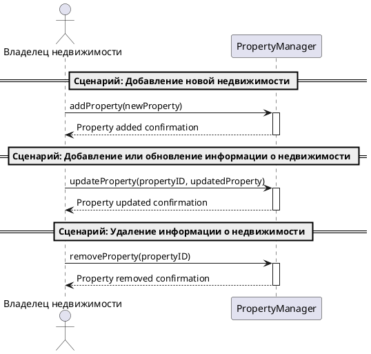

```plantuml
@startuml

actor "Владелец недвижимости" as Owner
participant "PropertyManager" as Manager

== Сценарий: Добавление новой недвижимости ==

Owner -> Manager : addProperty(newProperty)
activate Manager
Manager --> Owner : Property added confirmation

deactivate Manager

== Сценарий: Добавление или обновление информации о недвижимости ==

Owner -> Manager : updateProperty(propertyID, updatedProperty)
activate Manager
Manager --> Owner : Property updated confirmation

deactivate Manager

== Сценарий: Удаление информации о недвижимости ==

Owner -> Manager : removeProperty(propertyID)
activate Manager
Manager --> Owner : Property removed confirmation

deactivate Manager

@enduml
```
