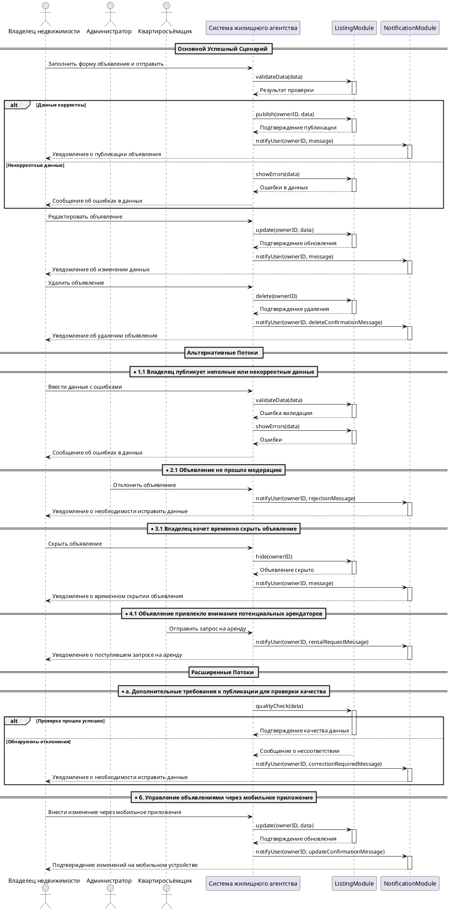

```plantuml
@startuml

actor "Владелец недвижимости" as Owner
actor "Администратор" as Admin
actor "Квартиросъёмщик" as Tenant

participant "Система жилищного агентства" as System
participant "ListingModule" as Listing
participant "NotificationModule" as Notifier

== Основной Успешный Сценарий ==

Owner -> System : Заполнить форму объявления и отправить
System -> Listing : validateData(data)
activate Listing
Listing --> System : Результат проверки
deactivate Listing

alt Данные корректны
    System -> Listing : publish(ownerID, data)
    activate Listing
    Listing --> System : Подтверждение публикации
    deactivate Listing

    System -> Notifier : notifyUser(ownerID, message)
    activate Notifier
    Notifier --> Owner : Уведомление о публикации объявления
    deactivate Notifier
else Некорректные данные
    System -> Listing : showErrors(data)
    activate Listing
    Listing --> System : Ошибки в данных
    deactivate Listing

    System --> Owner : Сообщение об ошибках в данных
end

Owner -> System : Редактировать объявление
System -> Listing : update(ownerID, data)
activate Listing
Listing --> System : Подтверждение обновления
deactivate Listing

System -> Notifier : notifyUser(ownerID, message)
activate Notifier
Notifier --> Owner : Уведомление об изменении данных
deactivate Notifier

Owner -> System : Удалить объявление
System -> Listing : delete(ownerID)
activate Listing
Listing --> System : Подтверждение удаления
deactivate Listing

System -> Notifier : notifyUser(ownerID, deleteConfirmationMessage)
activate Notifier
Notifier --> Owner : Уведомление об удалении объявления
deactivate Notifier

== Альтернативные Потоки ==

== *1.1 Владелец публикует неполные или некорректные данные ==

Owner -> System : Ввести данные с ошибками
System -> Listing : validateData(data)
activate Listing
Listing --> System : Ошибка валидации
deactivate Listing

System -> Listing : showErrors(data)
activate Listing
Listing --> System : Ошибки
deactivate Listing

System --> Owner : Сообщение об ошибках в данных

== *2.1 Объявление не прошло модерацию ==

Admin -> System : Отклонить объявление
System -> Notifier : notifyUser(ownerID, rejectionMessage)
activate Notifier
Notifier --> Owner : Уведомление о необходимости исправить данные
deactivate Notifier

== *3.1 Владелец хочет временно скрыть объявление ==

Owner -> System : Скрыть объявление
System -> Listing : hide(ownerID)
activate Listing
Listing --> System : Объявление скрыто
deactivate Listing

System -> Notifier : notifyUser(ownerID, message)
activate Notifier
Notifier --> Owner : Уведомление о временном скрытии объявления
deactivate Notifier

== *4.1 Объявление привлекло внимание потенциальных арендаторов ==

Tenant -> System : Отправить запрос на аренду
System -> Notifier : notifyUser(ownerID, rentalRequestMessage)
activate Notifier
Notifier --> Owner : Уведомление о поступившем запросе на аренду
deactivate Notifier

== Расширенные Потоки ==

== *а. Дополнительные требования к публикации для проверки качества ==

System -> Listing : qualityCheck(data)
activate Listing
alt Проверка прошла успешно
    Listing --> System : Подтверждение качества данных
deactivate Listing
else Обнаружены отклонения
    Listing --> System : Сообщение о несоответствии
    System -> Notifier : notifyUser(ownerID, correctionRequiredMessage)
    activate Notifier
    Notifier --> Owner : Уведомление о необходимости исправить данные
    deactivate Notifier
end

== *б. Управление объявлениями через мобильное приложение ==

Owner -> System : Внести изменения через мобильное приложение
System -> Listing : update(ownerID, data)
activate Listing
Listing --> System : Подтверждение обновления
deactivate Listing

System -> Notifier : notifyUser(ownerID, updateConfirmationMessage)
activate Notifier
Notifier --> Owner : Подтверждение изменений на мобильном устройстве
deactivate Notifier

@enduml
```