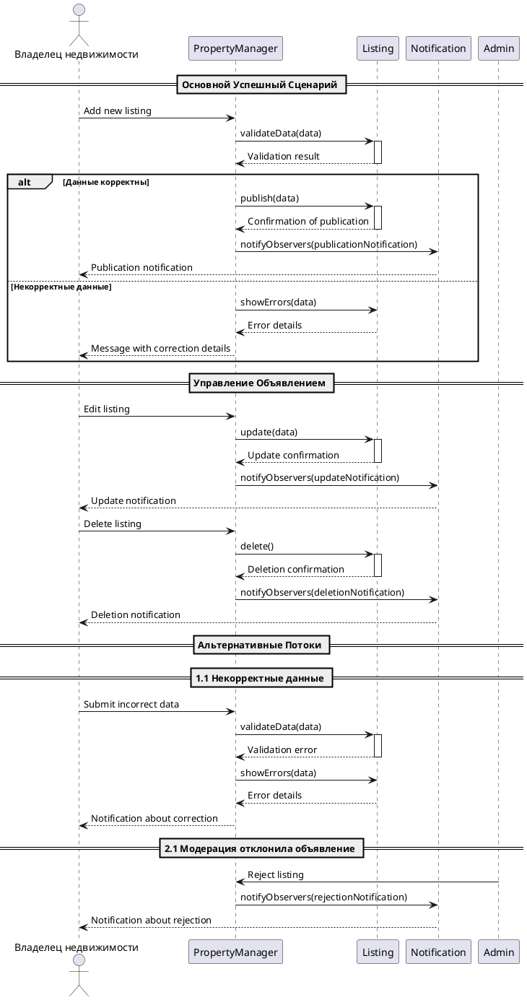

```plantuml
@startuml

actor "Владелец недвижимости" as Owner
participant "PropertyManager" as Manager
participant "Listing" as Listing
participant "Notification" as Notifier

== Основной Успешный Сценарий ==

Owner -> Manager : Add new listing
Manager -> Listing : validateData(data)
activate Listing
Listing --> Manager : Validation result
deactivate Listing

alt Данные корректны
    Manager -> Listing : publish(data)
    activate Listing
    Listing --> Manager : Confirmation of publication
    deactivate Listing

    Manager -> Notifier : notifyObservers(publicationNotification)
    Notifier --> Owner : Publication notification
else Некорректные данные
    Manager -> Listing : showErrors(data)
    Listing --> Manager : Error details
    Manager --> Owner : Message with correction details
end

== Управление Объявлением ==

Owner -> Manager : Edit listing
Manager -> Listing : update(data)
activate Listing
Listing --> Manager : Update confirmation
deactivate Listing

Manager -> Notifier : notifyObservers(updateNotification)
Notifier --> Owner : Update notification

Owner -> Manager : Delete listing
Manager -> Listing : delete()
activate Listing
Listing --> Manager : Deletion confirmation
deactivate Listing

Manager -> Notifier : notifyObservers(deletionNotification)
Notifier --> Owner : Deletion notification

== Альтернативные Потоки ==

== 1.1 Некорректные данные ==
Owner -> Manager : Submit incorrect data
Manager -> Listing : validateData(data)
activate Listing
Listing --> Manager : Validation error
deactivate Listing

Manager -> Listing : showErrors(data)
Listing --> Manager : Error details
Manager --> Owner : Notification about correction

== 2.1 Модерация отклонила объявление ==
Admin -> Manager : Reject listing
Manager -> Notifier : notifyObservers(rejectionNotification)
Notifier --> Owner : Notification about rejection

@enduml
```
