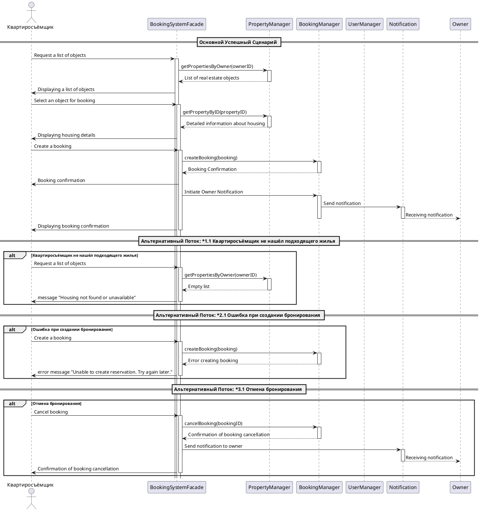

```plantuml
@startuml

actor "Квартиросъёмщик" as Tenant
participant "BookingSystemFacade" as System
participant "PropertyManager" as PropertyMgr
participant "BookingManager" as BookingMgr
participant "UserManager" as UserMgr
participant "Notification" as Notification
participant "Owner" as Owner

== Основной Успешный Сценарий ==

Tenant -> System : Request a list of objects
activate System

System -> PropertyMgr : getPropertiesByOwner(ownerID)
activate PropertyMgr
PropertyMgr --> System : List of real estate objects
deactivate PropertyMgr

System -> Tenant : Displaying a list of objects

Tenant -> System : Select an object for booking
activate System

System -> PropertyMgr : getPropertyByID(propertyID)
activate PropertyMgr
PropertyMgr --> System : Detailed information about housing
deactivate PropertyMgr

System -> Tenant : Displaying housing details

Tenant -> System : Create a booking
activate System

System -> BookingMgr : createBooking(booking)
activate BookingMgr
BookingMgr --> System : Booking Confirmation
deactivate BookingMgr

System -> Tenant : Booking confirmation

System -> BookingMgr : Initiate Owner Notification
activate BookingMgr
BookingMgr -> Notification : Send notification
activate Notification
Notification --> Owner : Receiving notification
deactivate Notification
deactivate BookingMgr

System -> Tenant : Displaying booking confirmation

deactivate System

== Альтернативный Поток: *1.1 Квартиросъёмщик не нашёл подходящего жилья ==

alt Квартиросъёмщик не нашёл подходящего жилья
    Tenant -> System : Request a list of objects
    activate System

    System -> PropertyMgr : getPropertiesByOwner(ownerID)
    activate PropertyMgr
    PropertyMgr --> System : Empty list
    deactivate PropertyMgr

    System -> Tenant : message "Housing not found or unavailable"

    deactivate System
end

== Альтернативный Поток: *2.1 Ошибка при создании бронирования ==

alt Ошибка при создании бронирования
    Tenant -> System : Create a booking
    activate System

    System -> BookingMgr : createBooking(booking)
    activate BookingMgr
    BookingMgr --> System : Error creating booking
    deactivate BookingMgr

    System -> Tenant : error message "Unable to create reservation. Try again later."
    deactivate System
end

== Альтернативный Поток: *3.1 Отмена бронирования ==

alt Отмена бронирования
    Tenant -> System : Cancel booking
    activate System

    System -> BookingMgr : cancelBooking(bookingID)
    activate BookingMgr
    BookingMgr --> System : Confirmation of booking cancellation
    deactivate BookingMgr

    System -> Notification : Send notification to owner
    activate Notification
    Notification --> Owner : Receiving notification
    deactivate Notification

    System -> Tenant : Confirmation of booking cancellation

    deactivate System
end

@enduml
```
