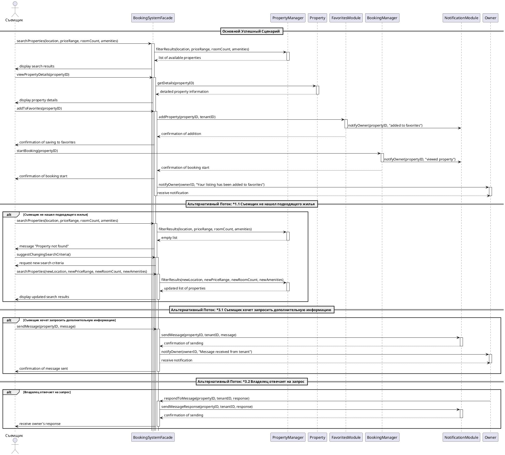

```plantuml
@startuml

actor "Съемщик" as Tenant
participant "BookingSystemFacade" as System
participant "PropertyManager" as Search
participant "Property" as Details
participant "FavoritesModule" as Favorites
participant "BookingManager" as Booking
participant "NotificationModule" as Notification

== Основной Успешный Сценарий ==

Tenant -> System : searchProperties(location, priceRange, roomCount, amenities)
activate System

System -> Search : filterResults(location, priceRange, roomCount, amenities)
activate Search
Search --> System : list of available properties
deactivate Search

System -> Tenant : display search results

Tenant -> System : viewPropertyDetails(propertyID)
activate System

System -> Details : getDetails(propertyID)
activate Details
Details --> System : detailed property information
deactivate Details

System -> Tenant : display property details

Tenant -> System : addToFavorites(propertyID)
activate System

System -> Favorites : addProperty(propertyID, tenantID)
activate Favorites

Favorites -> Notification : notifyOwner(propertyID, "added to favorites")
deactivate Favorites

Favorites --> System : confirmation of addition
deactivate Favorites

System -> Tenant : confirmation of saving to favorites

Tenant -> Booking : startBooking(propertyID)
activate Booking

Booking -> Notification : notifyOwner(propertyID, "viewed property")
deactivate Booking

Booking --> System : confirmation of booking start
deactivate Booking

System -> Tenant : confirmation of booking start

System -> Owner : notifyOwner(ownerID, "Your listing has been added to favorites")
activate Owner
Owner <-- System : receive notification
deactivate Owner

deactivate System

== Альтернативный Поток: *1.1 Съемщик не нашел подходящего жилья ==

alt Съемщик не нашел подходящего жилья
    Tenant -> System : searchProperties(location, priceRange, roomCount, amenities)
    activate System

    System -> Search : filterResults(location, priceRange, roomCount, amenities)
    activate Search
    Search --> System : empty list
    deactivate Search

    System -> Tenant : message "Property not found"
    
    Tenant -> System : suggestChangingSearchCriteria()
    activate System

    System -> Tenant : request new search criteria

    Tenant -> System : searchProperties(newLocation, newPriceRange, newRoomCount, newAmenities)
    activate System

    System -> Search : filterResults(newLocation, newPriceRange, newRoomCount, newAmenities)
    activate Search
    Search --> System : updated list of properties
    deactivate Search

    System -> Tenant : display updated search results
    deactivate System
end

== Альтернативный Поток: *3.1 Съемщик хочет запросить дополнительную информацию ==

alt Съемщик хочет запросить дополнительную информацию
    Tenant -> System : sendMessage(propertyID, message)
    activate System

    System -> Notification : sendMessage(propertyID, tenantID, message)
    activate Notification
    Notification --> System : confirmation of sending
    deactivate Notification

    System -> Owner : notifyOwner(ownerID, "Message received from tenant")
    activate Owner
    Owner <-- System : receive notification
    deactivate Owner

    System -> Tenant : confirmation of message sent
    deactivate System
end

== Альтернативный Поток: *3.2 Владелец отвечает на запрос ==

alt Владелец отвечает на запрос
    Owner -> System : respondToMessage(propertyID, tenantID, response)
    activate System

    System -> Notification : sendMessageResponse(propertyID, tenantID, response)
    activate Notification
    Notification --> System : confirmation of sending
    deactivate Notification

    System -> Tenant : receive owner's response
    deactivate System
end

@enduml
```
