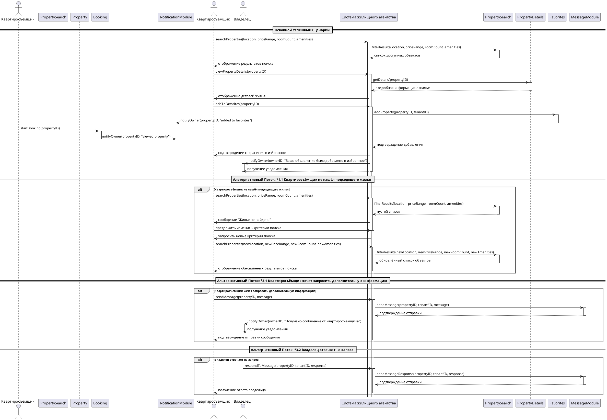

```plantuml
@startuml

actor Квартиросъёмщик
participant PropertySearch
participant Property
participant Favorites
participant Booking
participant NotificationModule

actor "Квартиросъёмщик" as Tenant
actor "Владелец" as Owner

participant "Система жилищного агентства" as System
participant "PropertySearch" as Search
participant "PropertyDetails" as Details
participant "FavoritesModule" as Favorites
participant "MessageModule" as Messaging

== Основной Успешный Сценарий ==

Tenant -> System : searchProperties(location, priceRange, roomCount, amenities)
activate System

System -> Search : filterResults(location, priceRange, roomCount, amenities)
activate Search
Search --> System : список доступных объектов
deactivate Search

System -> Tenant : отображение результатов поиска

Tenant -> System : viewPropertyDetails(propertyID)
activate System

System -> Details : getDetails(propertyID)
activate Details
Details --> System : подробная информация о жилье
deactivate Details

System -> Tenant : отображение деталей жилья

Tenant -> System : addToFavorites(propertyID)
activate System

System -> Favorites : addProperty(propertyID, tenantID)
activate Favorites

Favorites -> NotificationModule : notifyOwner(propertyID, "added to favorites")
deactivate Favorites
Квартиросъёмщик -> Booking : startBooking(propertyID)
activate Booking
Booking -> NotificationModule : notifyOwner(propertyID, "viewed property")
deactivate Booking

Favorites --> System : подтверждение добавления
deactivate Favorites

System -> Tenant : подтверждение сохранения в избранное

System -> Owner : notifyOwner(ownerID, "Ваше объявление было добавлено в избранное")
activate Owner
Owner <-- System : получение уведомления
deactivate Owner

deactivate System

== Альтернативный Поток: *1.1 Квартиросъёмщик не нашёл подходящего жилья ==

alt Квартиросъёмщик не нашёл подходящего жилья
    Tenant -> System : searchProperties(location, priceRange, roomCount, amenities)
    activate System

    System -> Search : filterResults(location, priceRange, roomCount, amenities)
    activate Search
    Search --> System : пустой список
    deactivate Search

    System -> Tenant : сообщение "Жилье не найдено"
    
    Tenant -> System : предложить изменить критерии поиска
    activate System

    System -> Tenant : запросить новые критерии поиска

    Tenant -> System : searchProperties(newLocation, newPriceRange, newRoomCount, newAmenities)
    activate System

    System -> Search : filterResults(newLocation, newPriceRange, newRoomCount, newAmenities)
    activate Search
    Search --> System : обновлённый список объектов
    deactivate Search

    System -> Tenant : отображение обновлённых результатов поиска
    deactivate System
end

== Альтернативный Поток: *3.1 Квартиросъёмщик хочет запросить дополнительную информацию ==

alt Квартиросъёмщик хочет запросить дополнительную информацию
    Tenant -> System : sendMessage(propertyID, message)
    activate System

    System -> Messaging : sendMessage(propertyID, tenantID, message)
    activate Messaging
    Messaging --> System : подтверждение отправки
    deactivate Messaging

    System -> Owner : notifyOwner(ownerID, "Получено сообщение от квартиросъёмщика")
    activate Owner
    Owner <-- System : получение уведомления
    deactivate Owner

    System -> Tenant : подтверждение отправки сообщения
    deactivate System
end

== Альтернативный Поток: *3.2 Владелец отвечает на запрос ==

alt Владелец отвечает на запрос
    Owner -> System : respondToMessage(propertyID, tenantID, response)
    activate System

    System -> Messaging : sendMessageResponse(propertyID, tenantID, response)
    activate Messaging
    Messaging --> System : подтверждение отправки
    deactivate Messaging

    System -> Tenant : получение ответа владельца
    deactivate System
end

@enduml
```
