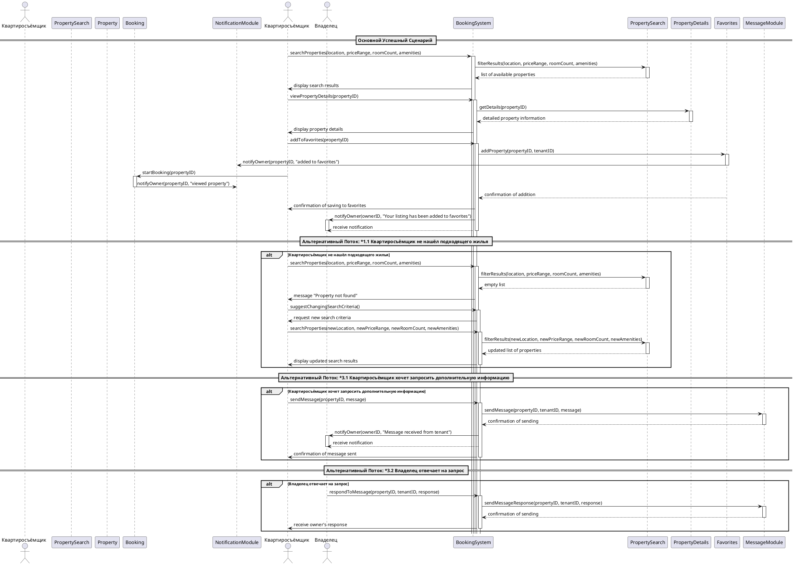

```plantuml
@startuml

actor Квартиросъёмщик
participant PropertySearch
participant Property
participant Favorites
participant Booking
participant NotificationModule

actor "Квартиросъёмщик" as Tenant
actor "Владелец" as Owner

participant "BookingSystem" as System
participant "PropertySearch" as Search
participant "PropertyDetails" as Details
participant "FavoritesModule" as Favorites
participant "MessageModule" as Messaging

== Основной Успешный Сценарий ==

Tenant -> System : searchProperties(location, priceRange, roomCount, amenities)
activate System

System -> Search : filterResults(location, priceRange, roomCount, amenities)
activate Search
Search --> System : list of available properties
deactivate Search

System -> Tenant : display search results

Tenant -> System : viewPropertyDetails(propertyID)
activate System

System -> Details : getDetails(propertyID)
activate Details
Details --> System : detailed property information
deactivate Details

System -> Tenant : display property details

Tenant -> System : addToFavorites(propertyID)
activate System

System -> Favorites : addProperty(propertyID, tenantID)
activate Favorites

Favorites -> NotificationModule : notifyOwner(propertyID, "added to favorites")
deactivate Favorites
Tenant -> Booking : startBooking(propertyID)
activate Booking
Booking -> NotificationModule : notifyOwner(propertyID, "viewed property")
deactivate Booking

Favorites --> System : confirmation of addition
deactivate Favorites

System -> Tenant : confirmation of saving to favorites

System -> Owner : notifyOwner(ownerID, "Your listing has been added to favorites")
activate Owner
Owner <-- System : receive notification
deactivate Owner

deactivate System

== Альтернативный Поток: *1.1 Квартиросъёмщик не нашёл подходящего жилья ==

alt Квартиросъёмщик не нашёл подходящего жилья
    Tenant -> System : searchProperties(location, priceRange, roomCount, amenities)
    activate System

    System -> Search : filterResults(location, priceRange, roomCount, amenities)
    activate Search
    Search --> System : empty list
    deactivate Search

    System -> Tenant : message "Property not found"
    
    Tenant -> System : suggestChangingSearchCriteria()
    activate System

    System -> Tenant : request new search criteria

    Tenant -> System : searchProperties(newLocation, newPriceRange, newRoomCount, newAmenities)
    activate System

    System -> Search : filterResults(newLocation, newPriceRange, newRoomCount, newAmenities)
    activate Search
    Search --> System : updated list of properties
    deactivate Search

    System -> Tenant : display updated search results
    deactivate System
end

== Альтернативный Поток: *3.1 Квартиросъёмщик хочет запросить дополнительную информацию ==

alt Квартиросъёмщик хочет запросить дополнительную информацию
    Tenant -> System : sendMessage(propertyID, message)
    activate System

    System -> Messaging : sendMessage(propertyID, tenantID, message)
    activate Messaging
    Messaging --> System : confirmation of sending
    deactivate Messaging

    System -> Owner : notifyOwner(ownerID, "Message received from tenant")
    activate Owner
    Owner <-- System : receive notification
    deactivate Owner

    System -> Tenant : confirmation of message sent
    deactivate System
end

== Альтернативный Поток: *3.2 Владелец отвечает на запрос ==

alt Владелец отвечает на запрос
    Owner -> System : respondToMessage(propertyID, tenantID, response)
    activate System

    System -> Messaging : sendMessageResponse(propertyID, tenantID, response)
    activate Messaging
    Messaging --> System : confirmation of sending
    deactivate Messaging

    System -> Tenant : receive owner's response
    deactivate System
end

@enduml
```
