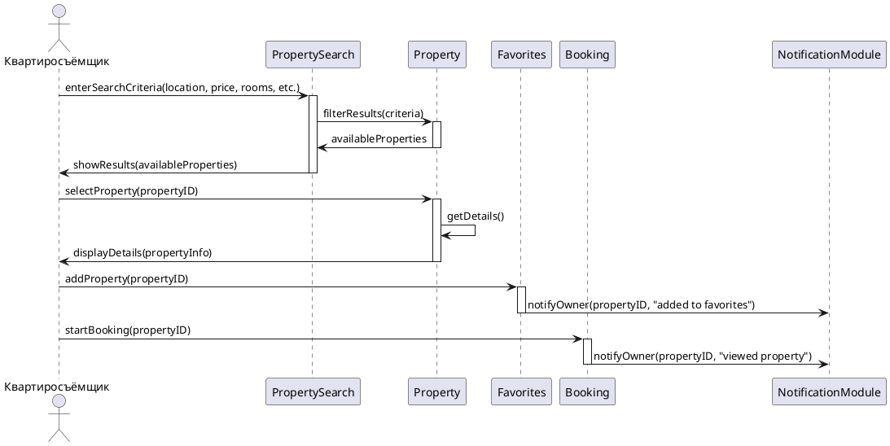

```plantuml
@startuml

actor Квартиросъёмщик
participant PropertySearch
participant Property
participant Favorites
participant Booking
participant NotificationModule

Квартиросъёмщик -> PropertySearch : enterSearchCriteria(location, price, rooms, etc.)
activate PropertySearch
PropertySearch -> Property : filterResults(criteria)
activate Property
Property -> PropertySearch : availableProperties
deactivate Property
Квартиросъёмщик <- PropertySearch : showResults(availableProperties)
deactivate PropertySearch

Квартиросъёмщик -> Property : selectProperty(propertyID)
activate Property
Property -> Property : getDetails()
Квартиросъёмщик <- Property : displayDetails(propertyInfo)
deactivate Property

Квартиросъёмщик -> Favorites : addProperty(propertyID)
activate Favorites
Favorites -> NotificationModule : notifyOwner(propertyID, "added to favorites")
deactivate Favorites
Квартиросъёмщик -> Booking : startBooking(propertyID)
activate Booking
Booking -> NotificationModule : notifyOwner(propertyID, "viewed property")
deactivate Booking

@enduml
```
