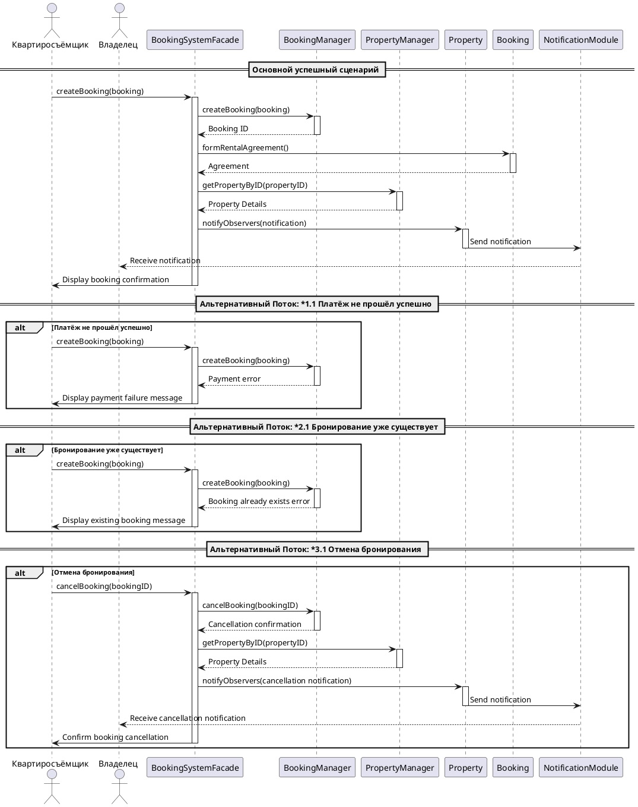

```plantuml
@startuml

actor "Квартиросъёмщик" as Tenant
actor "Владелец" as Owner

participant "BookingSystemFacade" as System
participant "BookingManager" as BookingMgr
participant "PropertyManager" as PropertyMgr
participant "Property" as Property
participant "Booking" as Booking
participant "NotificationModule" as Notification

== Основной успешный сценарий ==

Tenant -> System : createBooking(booking)
activate System

System -> BookingMgr : createBooking(booking)
activate BookingMgr
BookingMgr --> System : Booking ID
deactivate BookingMgr

System -> Booking : formRentalAgreement()
activate Booking
Booking --> System : Agreement
deactivate Booking

System -> PropertyMgr : getPropertyByID(propertyID)
activate PropertyMgr
PropertyMgr --> System : Property Details
deactivate PropertyMgr

System -> Property : notifyObservers(notification)
activate Property
Property -> Notification : Send notification
deactivate Property

Notification --> Owner : Receive notification

System -> Tenant : Display booking confirmation

deactivate System

== Альтернативный Поток: *1.1 Платёж не прошёл успешно ==

alt Платёж не прошёл успешно
    Tenant -> System : createBooking(booking)
    activate System

    System -> BookingMgr : createBooking(booking)
    activate BookingMgr
    BookingMgr --> System : Payment error
    deactivate BookingMgr

    System -> Tenant : Display payment failure message

    deactivate System
end

== Альтернативный Поток: *2.1 Бронирование уже существует ==

alt Бронирование уже существует
    Tenant -> System : createBooking(booking)
    activate System

    System -> BookingMgr : createBooking(booking)
    activate BookingMgr
    BookingMgr --> System : Booking already exists error
    deactivate BookingMgr

    System -> Tenant : Display existing booking message

    deactivate System
end

== Альтернативный Поток: *3.1 Отмена бронирования ==

alt Отмена бронирования
    Tenant -> System : cancelBooking(bookingID)
    activate System

    System -> BookingMgr : cancelBooking(bookingID)
    activate BookingMgr
    BookingMgr --> System : Cancellation confirmation
    deactivate BookingMgr

    System -> PropertyMgr : getPropertyByID(propertyID)
    activate PropertyMgr
    PropertyMgr --> System : Property Details
    deactivate PropertyMgr

    System -> Property : notifyObservers(cancellation notification)
    activate Property
    Property -> Notification : Send notification
    deactivate Property

    Notification --> Owner : Receive cancellation notification

    System -> Tenant : Confirm booking cancellation

    deactivate System
end

@enduml
```
