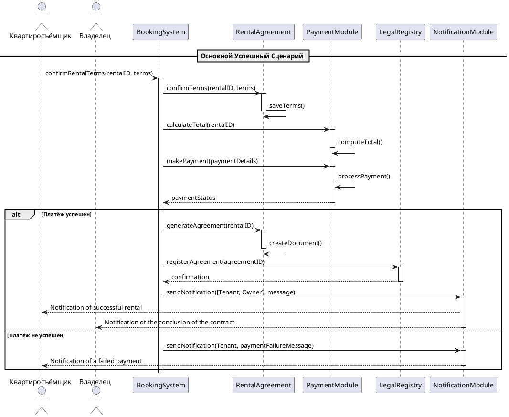

```plantuml
@startuml

actor "Квартиросъёмщик" as Tenant
actor "Владелец" as Owner

participant "BookingSystem" as System
participant "RentalAgreement" as Agreement
participant "PaymentModule" as Payment
participant "LegalRegistry" as LegalRegistry
participant "NotificationModule" as Notifier

== Основной Успешный Сценарий ==

Tenant -> System : confirmRentalTerms(rentalID, terms)
activate System

System -> Agreement : confirmTerms(rentalID, terms)
activate Agreement
Agreement -> Agreement : saveTerms()
deactivate Agreement

System -> Payment : calculateTotal(rentalID)
activate Payment
Payment -> Payment : computeTotal()
deactivate Payment

System -> Payment : makePayment(paymentDetails)
activate Payment
Payment -> Payment : processPayment()
Payment --> System : paymentStatus
deactivate Payment

alt Платёж успешен
    System -> Agreement : generateAgreement(rentalID)
    activate Agreement
    Agreement -> Agreement : createDocument()
    deactivate Agreement

    System -> LegalRegistry : registerAgreement(agreementID)
    activate LegalRegistry
    LegalRegistry --> System : confirmation
    deactivate LegalRegistry

    System -> Notifier : sendNotification([Tenant, Owner], message)
    activate Notifier
    Notifier --> Tenant : Notification of successful rental
    Notifier --> Owner : Notification of the conclusion of the contract
    deactivate Notifier
else Платёж не успешен
    System -> Notifier : sendNotification(Tenant, paymentFailureMessage)
    activate Notifier
    Notifier --> Tenant : Notification of a failed payment
    deactivate Notifier
end

deactivate System

@enduml
```