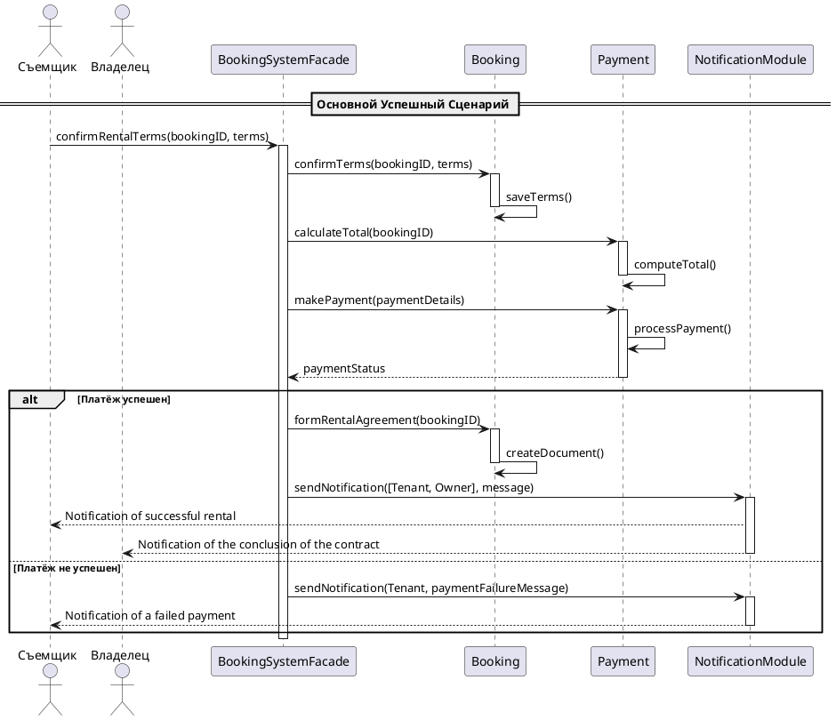

```plantuml
@startuml

actor "Съемщик" as Tenant
actor "Владелец" as Owner

participant "BookingSystemFacade" as System
participant "Booking" as Agreement
participant "Payment" as Payment
participant "NotificationModule" as Notification

== Основной Успешный Сценарий ==

Tenant -> System : confirmRentalTerms(bookingID, terms)
activate System

System -> Agreement : confirmTerms(bookingID, terms)
activate Agreement
Agreement -> Agreement : saveTerms()
deactivate Agreement

System -> Payment : calculateTotal(bookingID)
activate Payment
Payment -> Payment : computeTotal()
deactivate Payment

System -> Payment : makePayment(paymentDetails)
activate Payment
Payment -> Payment : processPayment()
Payment --> System : paymentStatus
deactivate Payment

alt Платёж успешен
    System -> Agreement : formRentalAgreement(bookingID)
    activate Agreement
    Agreement -> Agreement : createDocument()
    deactivate Agreement

    System -> Notification : sendNotification([Tenant, Owner], message)
    activate Notification
    Notification --> Tenant : Notification of successful rental
    Notification --> Owner : Notification of the conclusion of the contract
    deactivate Notification
else Платёж не успешен
    System -> Notification : sendNotification(Tenant, paymentFailureMessage)
    activate Notification
    Notification --> Tenant : Notification of a failed payment
    deactivate Notification
end

deactivate System

@enduml
```