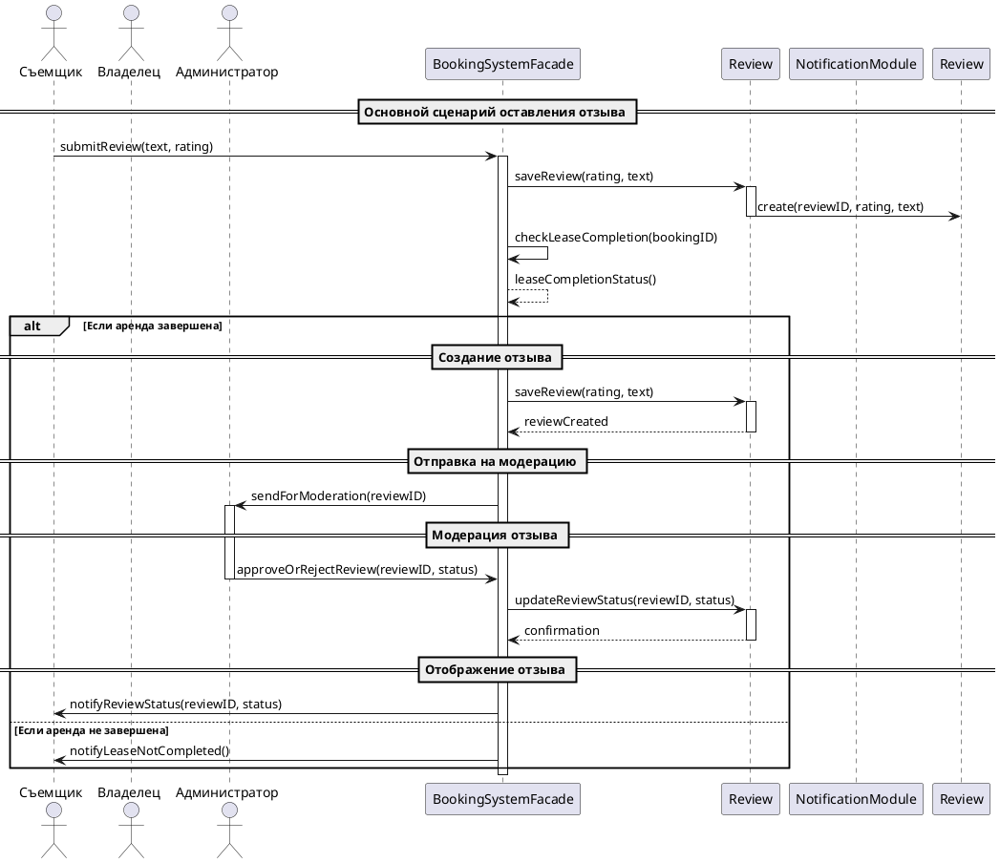

```plantuml
@startuml

actor "Съемщик" as Tenant
actor "Владелец" as Owner
actor "Администратор" as Administrator

participant "BookingSystemFacade" as System
participant "Review" as ReviewModule
participant "NotificationModule" as Notification

== Основной сценарий оставления отзыва ==

Tenant -> System : submitReview(text, rating)
activate System

System -> ReviewModule : saveReview(rating, text)
activate ReviewModule
ReviewModule -> Review : create(reviewID, rating, text)
deactivate ReviewModule

System -> System : checkLeaseCompletion(bookingID)
System --> System : leaseCompletionStatus()

alt Если аренда завершена
    == Создание отзыва ==
    System -> ReviewModule : saveReview(rating, text)
    activate ReviewModule
    ReviewModule --> System : reviewCreated
    deactivate ReviewModule

    == Отправка на модерацию ==
    System -> Administrator : sendForModeration(reviewID)
    activate Administrator

    == Модерация отзыва ==
    Administrator -> System : approveOrRejectReview(reviewID, status)
    deactivate Administrator

    System -> ReviewModule : updateReviewStatus(reviewID, status)
    activate ReviewModule
    ReviewModule --> System : confirmation
    deactivate ReviewModule

    == Отображение отзыва ==
    System -> Tenant : notifyReviewStatus(reviewID, status)
else Если аренда не завершена
    System -> Tenant : notifyLeaseNotCompleted()
end

deactivate System

@enduml
```