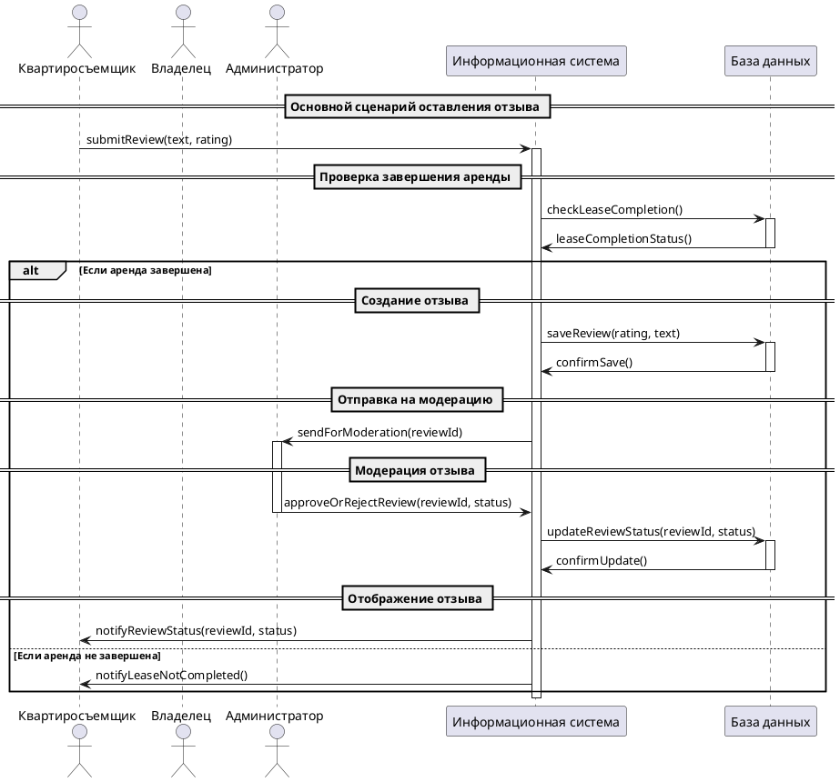

```plantuml
@startuml

actor "Квартиросъемщик" as Tenant
actor "Владелец" as Owner
actor "Администратор" as Administrator
participant "Информационная система" as System
participant "База данных" as DB

== Основной сценарий оставления отзыва ==
Tenant -> System: submitReview(text, rating)
activate System

== Проверка завершения аренды ==
System -> DB: checkLeaseCompletion()
activate DB
DB -> System: leaseCompletionStatus()
deactivate DB

alt Если аренда завершена
    == Создание отзыва ==
    System -> DB: saveReview(rating, text)
    activate DB
    DB -> System: confirmSave()
    deactivate DB

    == Отправка на модерацию ==
    System -> Administrator: sendForModeration(reviewId)
    activate Administrator

    == Модерация отзыва ==
    Administrator -> System: approveOrRejectReview(reviewId, status)
    deactivate Administrator

    System -> DB: updateReviewStatus(reviewId, status)
    activate DB
    DB -> System: confirmUpdate()
    deactivate DB

    == Отображение отзыва ==
    System -> Tenant: notifyReviewStatus(reviewId, status)
else Если аренда не завершена
    System -> Tenant: notifyLeaseNotCompleted()
end

deactivate System

@enduml
```