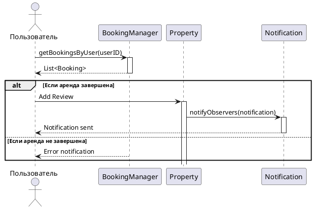

```plantuml
@startuml

actor "Пользователь" as User
participant "BookingManager" as BookingManager
participant "Property" as Property
participant "Notification" as Notification

User -> BookingManager : getBookingsByUser(userID)
activate BookingManager
BookingManager --> User : List<Booking>
deactivate BookingManager

alt Если аренда завершена
    User -> Property : Add Review
    activate Property
    Property -> Notification : notifyObservers(notification)
    activate Notification
    Notification --> User : Notification sent
    deactivate Notification
else Если аренда не завершена
    BookingManager --> User : Error notification
end

@enduml
```
