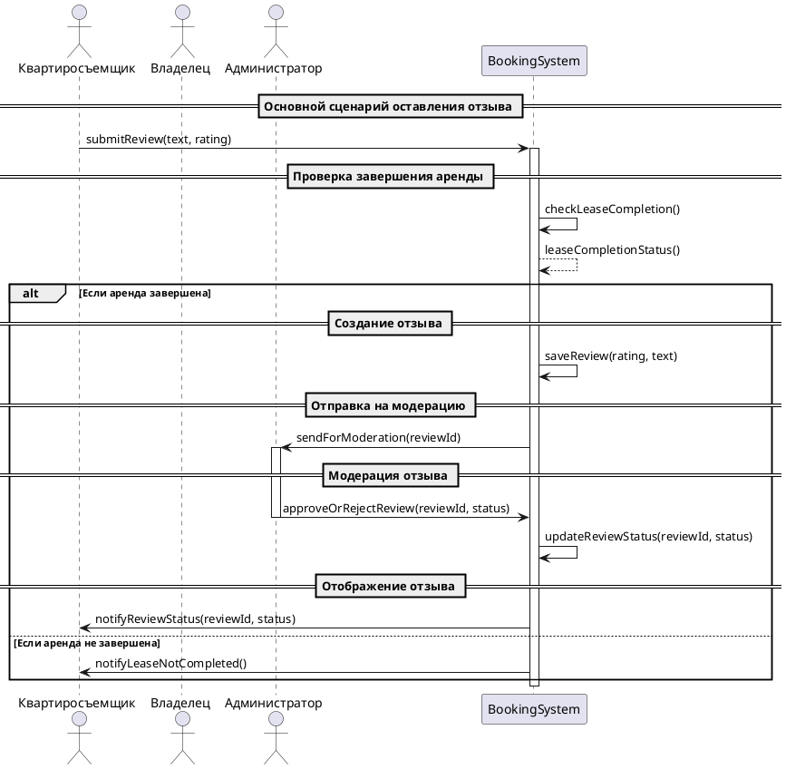

```plantuml
@startuml

actor "Квартиросъемщик" as Tenant
actor "Владелец" as Owner
actor "Администратор" as Administrator
participant "BookingSystem" as System

== Основной сценарий оставления отзыва ==
Tenant -> System: submitReview(text, rating)
activate System

== Проверка завершения аренды ==
System -> System: checkLeaseCompletion()
System --> System: leaseCompletionStatus()

alt Если аренда завершена
    == Создание отзыва ==
    System -> System: saveReview(rating, text)

    == Отправка на модерацию ==
    System -> Administrator: sendForModeration(reviewId)
    activate Administrator

    == Модерация отзыва ==
    Administrator -> System: approveOrRejectReview(reviewId, status)
    deactivate Administrator

    System -> System: updateReviewStatus(reviewId, status)

    == Отображение отзыва ==
    System -> Tenant: notifyReviewStatus(reviewId, status)
else Если аренда не завершена
    System -> Tenant: notifyLeaseNotCompleted()
end

deactivate System

@enduml
```