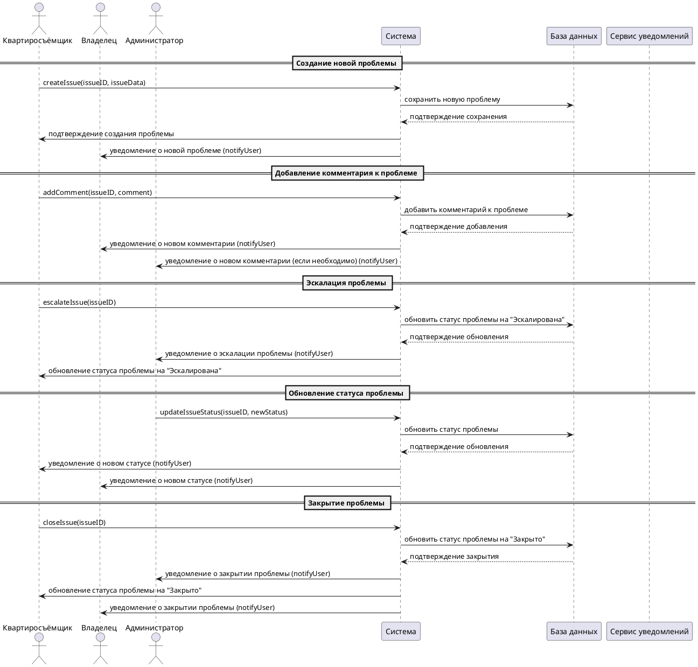

```plantuml

@startuml
actor Квартиросъёмщик
actor Владелец
actor Администратор
participant "Система" as System
participant "База данных" as Database
participant "Сервис уведомлений" as NotificationService

== Создание новой проблемы ==
Квартиросъёмщик -> System: createIssue(issueID, issueData)
System -> Database: сохранить новую проблему
Database --> System: подтверждение сохранения
System -> Квартиросъёмщик: подтверждение создания проблемы
System -> Владелец: уведомление о новой проблеме (notifyUser)

== Добавление комментария к проблеме ==
Квартиросъёмщик -> System: addComment(issueID, comment)
System -> Database: добавить комментарий к проблеме
Database --> System: подтверждение добавления
System -> Владелец: уведомление о новом комментарии (notifyUser)
System -> Администратор: уведомление о новом комментарии (если необходимо) (notifyUser)

== Эскалация проблемы ==
Квартиросъёмщик -> System: escalateIssue(issueID)
System -> Database: обновить статус проблемы на "Эскалирована"
Database --> System: подтверждение обновления
System -> Администратор: уведомление о эскалации проблемы (notifyUser)
System -> Квартиросъёмщик: обновление статуса проблемы на "Эскалирована"

== Обновление статуса проблемы ==
Администратор -> System: updateIssueStatus(issueID, newStatus)
System -> Database: обновить статус проблемы
Database --> System: подтверждение обновления
System -> Квартиросъёмщик: уведомление о новом статусе (notifyUser)
System -> Владелец: уведомление о новом статусе (notifyUser)

== Закрытие проблемы ==
Квартиросъёмщик -> System: closeIssue(issueID)
System -> Database: обновить статус проблемы на "Закрыто"
Database --> System: подтверждение закрытия
System -> Администратор: уведомление о закрытии проблемы (notifyUser)
System -> Квартиросъёмщик: обновление статуса проблемы на "Закрыто"
System -> Владелец: уведомление о закрытии проблемы (notifyUser)

@enduml

```