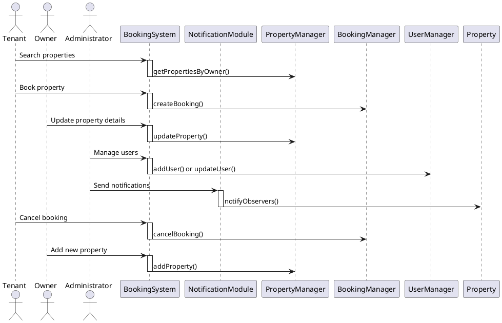

```plantuml

@startuml

actor "Tenant" as Tenant
actor "Owner" as Owner
actor "Administrator" as Admin
participant "BookingSystem" as System
participant "NotificationModule" as NotificationService


Tenant -> System: Search properties
activate System
System -> PropertyManager: getPropertiesByOwner()
deactivate System

Tenant -> System: Book property
activate System
System -> BookingManager: createBooking()
deactivate System

Owner -> System: Update property details
activate System
System -> PropertyManager: updateProperty()
deactivate System

Admin -> System: Manage users
activate System
System -> UserManager: addUser() or updateUser()
deactivate System

Admin -> NotificationService: Send notifications
activate NotificationService
NotificationService -> Property: notifyObservers()
deactivate NotificationService

Tenant -> System: Cancel booking
activate System
System -> BookingManager: cancelBooking()
deactivate System

Owner -> System: Add new property
activate System
System -> PropertyManager: addProperty()
deactivate System

@enduml

```