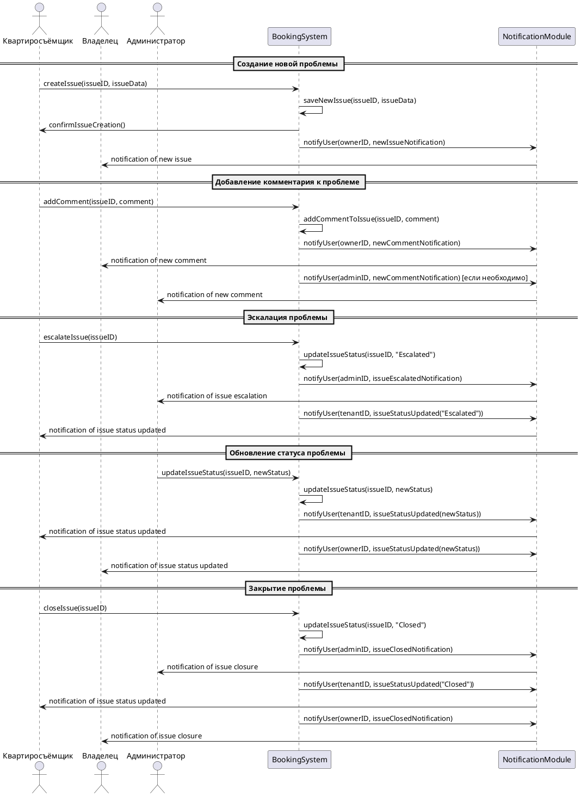

```plantuml

@startuml
actor Квартиросъёмщик
actor Владелец
actor Администратор
participant "BookingSystem" as System
participant "NotificationModule" as NotificationService

== Создание новой проблемы ==
Квартиросъёмщик -> System: createIssue(issueID, issueData)
System -> System: saveNewIssue(issueID, issueData)
System -> Квартиросъёмщик: confirmIssueCreation()
System -> NotificationService: notifyUser(ownerID, newIssueNotification)
NotificationService -> Владелец: notification of new issue

== Добавление комментария к проблеме ==
Квартиросъёмщик -> System: addComment(issueID, comment)
System -> System: addCommentToIssue(issueID, comment)
System -> NotificationService: notifyUser(ownerID, newCommentNotification)
NotificationService -> Владелец: notification of new comment
System -> NotificationService: notifyUser(adminID, newCommentNotification) [если необходимо]
NotificationService -> Администратор: notification of new comment

== Эскалация проблемы ==
Квартиросъёмщик -> System: escalateIssue(issueID)
System -> System: updateIssueStatus(issueID, "Escalated")
System -> NotificationService: notifyUser(adminID, issueEscalatedNotification)
NotificationService -> Администратор: notification of issue escalation
System -> NotificationService: notifyUser(tenantID, issueStatusUpdated("Escalated"))
NotificationService -> Квартиросъёмщик: notification of issue status updated

== Обновление статуса проблемы ==
Администратор -> System: updateIssueStatus(issueID, newStatus)
System -> System: updateIssueStatus(issueID, newStatus)
System -> NotificationService: notifyUser(tenantID, issueStatusUpdated(newStatus))
NotificationService -> Квартиросъёмщик: notification of issue status updated
System -> NotificationService: notifyUser(ownerID, issueStatusUpdated(newStatus))
NotificationService -> Владелец: notification of issue status updated

== Закрытие проблемы ==
Квартиросъёмщик -> System: closeIssue(issueID)
System -> System: updateIssueStatus(issueID, "Closed")
System -> NotificationService: notifyUser(adminID, issueClosedNotification)
NotificationService -> Администратор: notification of issue closure
System -> NotificationService: notifyUser(tenantID, issueStatusUpdated("Closed"))
NotificationService -> Квартиросъёмщик: notification of issue status updated
System -> NotificationService: notifyUser(ownerID, issueClosedNotification)
NotificationService -> Владелец: notification of issue closure

@enduml

```