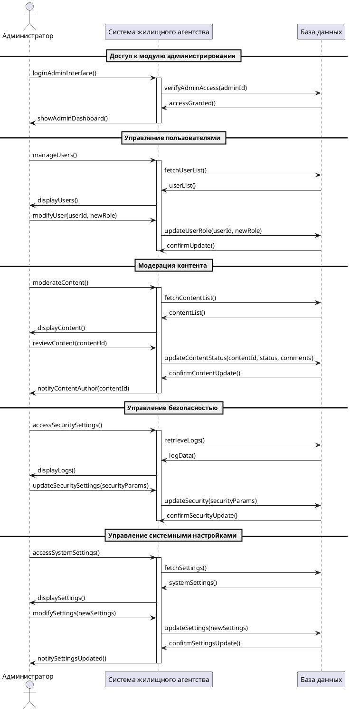

```plantuml
@startuml

actor "Администратор" as Administrator
participant "Система жилищного агентства" as System
participant "База данных" as DB

== Доступ к модулю администрирования ==
Administrator -> System: loginAdminInterface()
activate System
System -> DB: verifyAdminAccess(adminId)
DB -> System: accessGranted()
System -> Administrator: showAdminDashboard()
deactivate System

== Управление пользователями ==
Administrator -> System: manageUsers()
activate System
System -> DB: fetchUserList()
DB -> System: userList()
System -> Administrator: displayUsers()
Administrator -> System: modifyUser(userId, newRole)
System -> DB: updateUserRole(userId, newRole)
DB -> System: confirmUpdate()
deactivate System

== Модерация контента ==
Administrator -> System: moderateContent()
activate System
System -> DB: fetchContentList()
DB -> System: contentList()
System -> Administrator: displayContent()
Administrator -> System: reviewContent(contentId)
System -> DB: updateContentStatus(contentId, status, comments)
DB -> System: confirmContentUpdate()
System -> Administrator: notifyContentAuthor(contentId)
deactivate System

== Управление безопасностью ==
Administrator -> System: accessSecuritySettings()
activate System
System -> DB: retrieveLogs()
DB -> System: logData()
System -> Administrator: displayLogs()
Administrator -> System: updateSecuritySettings(securityParams)
System -> DB: updateSecurity(securityParams)
DB -> System: confirmSecurityUpdate()
deactivate System

== Управление системными настройками ==
Administrator -> System: accessSystemSettings()
activate System
System -> DB: fetchSettings()
DB -> System: systemSettings()
System -> Administrator: displaySettings()
Administrator -> System: modifySettings(newSettings)
System -> DB: updateSettings(newSettings)
DB -> System: confirmSettingsUpdate()
System -> Administrator: notifySettingsUpdated()
deactivate System

@enduml
```