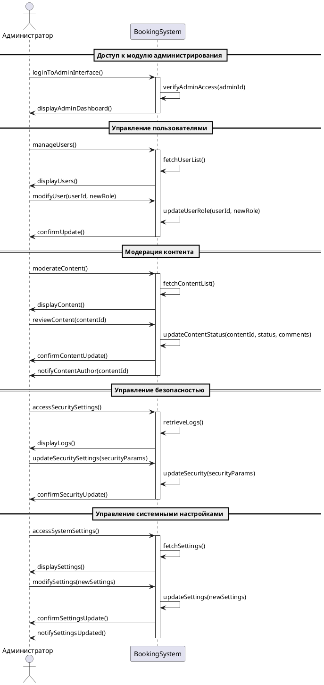

```plantuml
@startuml

actor "Администратор" as Administrator
participant "BookingSystem" as System

== Доступ к модулю администрирования ==
Administrator -> System: loginToAdminInterface()
activate System
System -> System: verifyAdminAccess(adminId)
System -> Administrator: displayAdminDashboard()
deactivate System

== Управление пользователями ==
Administrator -> System: manageUsers()
activate System
System -> System: fetchUserList()
System -> Administrator: displayUsers()
Administrator -> System: modifyUser(userId, newRole)
System -> System: updateUserRole(userId, newRole)
System -> Administrator: confirmUpdate()
deactivate System

== Модерация контента ==
Administrator -> System: moderateContent()
activate System
System -> System: fetchContentList()
System -> Administrator: displayContent()
Administrator -> System: reviewContent(contentId)
System -> System: updateContentStatus(contentId, status, comments)
System -> Administrator: confirmContentUpdate()
System -> Administrator: notifyContentAuthor(contentId)
deactivate System

== Управление безопасностью ==
Administrator -> System: accessSecuritySettings()
activate System
System -> System: retrieveLogs()
System -> Administrator: displayLogs()
Administrator -> System: updateSecuritySettings(securityParams)
System -> System: updateSecurity(securityParams)
System -> Administrator: confirmSecurityUpdate()
deactivate System

== Управление системными настройками ==
Administrator -> System: accessSystemSettings()
activate System
System -> System: fetchSettings()
System -> Administrator: displaySettings()
Administrator -> System: modifySettings(newSettings)
System -> System: updateSettings(newSettings)
System -> Administrator: confirmSettingsUpdate()
System -> Administrator: notifySettingsUpdated()
deactivate System

@enduml
```