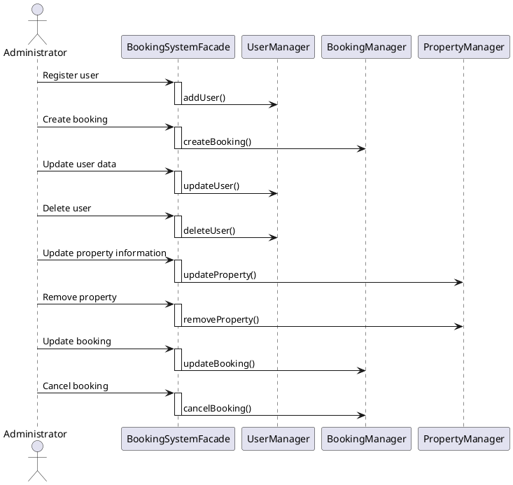

```plantuml

@startuml

actor "Administrator" as Admin
participant "BookingSystemFacade" as System


Admin -> System: Register user
activate System
System -> UserManager: addUser()
deactivate System

Admin -> System: Create booking
activate System
System -> BookingManager: createBooking()
deactivate System

Admin -> System: Update user data
activate System
System -> UserManager: updateUser()
deactivate System

Admin -> System: Delete user
activate System
System -> UserManager: deleteUser()
deactivate System

Admin -> System: Update property information
activate System
System -> PropertyManager: updateProperty()
deactivate System

Admin -> System: Remove property
activate System
System -> PropertyManager: removeProperty()
deactivate System

Admin -> System: Update booking
activate System
System -> BookingManager: updateBooking()
deactivate System

Admin -> System: Cancel booking
activate System
System -> BookingManager: cancelBooking()
deactivate System

@enduml

```
